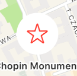

# MapKit

Transkrypcja z wideo na YouTube 


## MapKit z SwiftUI - Regiony, Markery i Adnotacje oraz CameraPosition

https://youtu.be/9xzHJAT_Iqk?si=3PNCiLwANBctonzH


​	Kiedy skończymy, aplikacja będzie wyglądać mniej więcej tak. Teraz mogą nastąpić pewne zmiany, ponieważ jest to aplikacja, na której oparłem tę serię, ale może się nieco zmienić, gdy będę bardziej zagłębiał się w tę serię. Kiedy uruchamiam aplikację, jestem przenoszony do mojej bieżącej lokalizacji. Moja aktualna lokalizacja znajduje się tutaj, gdzie jest mój dom. Tak się składa, że zapisałem ten region jako jedno z moich miejsc docelowych, jak wkrótce zobaczysz. Zapisałem kilka lokalizacji, które regularnie odwiedzam, a wszystkie informacje są przechowywane za pomocą SwiftData. Mogę więc powiększyć mapę, wybrać jedną z zaznaczonych lokalizacji i uzyskać podgląd tego obszaru. Mogę zobaczyć, ile czasu zajmie mi jazda samochodem lub nawet spacer. Mogę też otworzyć lokalizację w Mapach Apple. Mogę też wyświetlić trasę w tej aplikacji. Mogę też uzyskać wskazówki krok po kroku. Mogę zmienić wygląd mapy, może satelitarnej z drogami, ustawić wysokość na realistyczną i wybrać wyświetlanie innych punktów widzenia, a może pokazać lub ukryć ruch drogowy. Następnie mogę powiększyć mapę i przejść do trybu 3D. Mogę nawet zmienić nachylenie, aby uzyskać wspaniały widok 3D. A skoro już tu jestem, pozwól, że poszukam kawiarni i zobaczę, czy znajdę taką, która mi się spodoba. Wszystkie te funkcje są dostępne dzięki MapKit dla SwiftUI. Inną zaletą tej aplikacji jest możliwość wykorzystania jej do planowania wakacji. Na karcie miejsc docelowych możesz utworzyć lokalizacje, które chcesz odwiedzić, a w każdym przypadku wybrać region i dodać kilka miejsc, które chcesz odwiedzić. Na mojej aktualnej liście lokalizacji mam już Berlin, Paryż i Vancouver. Gdy odwiedzam każde z miejsc docelowych, region mapy zmienia się, aby pokazać ten region i wszystkie zapisane w nim lokalizacje. Utworzę więc nową lokalizację. Naprawdę chcę wrócić do Sztokholmu, więc chcę dodać go do mojej listy. Gdy dodam tę lokalizację, widok zostanie domyślnie ustawiony na bieżącą lokalizację. Wyszukajmy więc Sztokholm. Następnie mogę dostosować i ustawić region na ten, który chcę odwiedzić. Wyszukam i dodam kilka atrakcji. Po znalezieniu miejsc, które chcę odwiedzić, dodaję je do mojej bazy danych. Zostaną one dodane do tych miejsc dla Sztokholmu. Jedną z atrakcji, której nie widziałem, jest Muzeum Vasa. Pozwól mi je wyszukać. I mogę je dodać. Teraz, gdy odwiedzę Sztokholm i otworzę aplikację, pierwszy ekran pokaże tę lokalizację i wszystkie zapisane znaczniki. Myślę, że to całkiem przydatna aplikacja. Mam więc nadzieję, że pozostaniesz ze mną podczas tworzenia aplikacji. 


Rzućmy więc okiem na projekt startowy. Tak naprawdę nie ma tu zbyt wiele kodu. Wszystko, co zrobiłem, jest następujące. Aplikacja uruchamia się i prezentuje kartę Start, która jest widokiem karty wyświetlającym widok mapy podróży lub widok mapy lokalizacji docelowych.

```swift
struct StartTab: View {
    var body: some View {
        TabView {
            Group{
                TripMapView()
                    .tabItem {
                        Label("TripMap", systemImage: "map")
                    }
                DestinationLocationsMapView()
                    .tabItem {
                        Label("Destinations", systemImage: "globe.desk")
                    }
            }
            .toolbarBackground(.appBlue.opacity(0.8), for: .tabBar)
            .toolbarBackground(.visible, for: .tabBar)
            .toolbarColorScheme(.dark, for: .tabBar)
        }
    }
}
```

 Zastosowałem również trzy modyfikatory, które mają zastosowanie do paska zakładek, dzięki czemu otrzymałem niebieski pasek zakładek na dole. Każdy z tych widoków znajduje się w osobnej grupie i są to tylko ogólne widoki z pojedynczym widokiem tekstowym. Dodałem kilka zasobów do projektu. Jest kolor akcentujący. Jest też inny kolor o nazwie app blue. Dodałem ikonę aplikacji. Obraz o nazwie Wieża Eiffla. I kolejny obraz o nazwie ekran startowy, który jest używany na naszym ekranie startowym. I wreszcie, kolejny obraz zatytułowany Sacre Coeur. Oto plik scenorysu ekranu startowego, który wyświetla ekran startowy podczas uruchamiania. Dodałem do niego ten obraz ekranu startowego. Ustawiłem również tło, aby używało koloru tła systemowego. Sama aplikacja będzie działać na iPhonie i iPadzie. Ale w przypadku telefonu ograniczyłem orientację tylko do pionowej. I jak widać, dodałem ekran startowy wyświetlający storyboard ekranu startowego podczas uruchamiania. 

Podczas tworzenia tej aplikacji będę pokazywał wiele funkcji dostępnych w API mapy. Nie wszystkie z nich zostaną wykorzystane w naszym projekcie, ale postaram się przedstawić możliwości tam, gdzie to możliwe. Ten pierwszy film jest tego najlepszym przykładem. Ukończony kod będzie znajdował się w gałęzi zatytułowanej V1 Map Marker Annotation Region. Zamierzam pokazać kilka podstawowych funkcji w widoku mapy. Ale w następnym filmie w zasadzie wyrwiemy ten widok i zaimplementujemy nasz projekt, który wykorzystuje dane Swift do utrwalania naszych miejsc docelowych i lokalizacji na naszych urządzeniach między uruchomieniami. 

Zakładka Destinations będzie używana do wyświetlania wszystkich miejsc, które wybraliśmy do odwiedzenia dla danego miejsca docelowego. Gdy ten widok zostanie zaprezentowany, powiększy się do tej konkretnej lokalizacji i przedstawi na mapie wszystkie znaczniki lub adnotacje na mapie do miejsca, które chcemy odwiedzić. Cóż, mapa istnieje od iOS 3 i została udostępniona w SwiftUI i iOS 14. Było to jednak dość ograniczone. Jednak wraz z wprowadzeniem iOS 17 zostało to znacznie ulepszone. Nie jesteśmy jeszcze do końca z parytetem zestawu UI, ale jesteśmy coraz bliżej. Aby utworzyć i pracować z mapą w SwiftUI, musimy najpierw zaimportować zestaw map. Następnie możemy zastąpić dostarczony widok tekstowy prostym widokiem mapy.

```swift
import SwiftUI
import MapKit

struct DestinationLocationsMapView: View {
    var body: some View {
        Map()
    }
}

#Preview {
    DestinationLocationsMapView()
}

```

 Mamy teraz w pełni funkcjonalną mapę wyświetlaną na ekranie, a widok, który otrzymamy, będzie zależał od ustawień regionalnych dla konkretnego urządzenia lub komputera w Xcode. W moim przypadku jestem Kanadyjczykiem, a mój podgląd Xcode został ustawiony na USA i widzę mapę Ameryki Północnej. Zanim przejdę dalej, musisz zapoznać się ze sposobem przesuwania widocznego regionu wyświetlanego na płótnie podglądu lub w symulatorze. 

- Możesz kliknąć i przeciągnąć, co pozwoli ci przesunąć widoczny obszar. Jeśli chcesz powiększyć mapę, możesz to zrobić na kilka różnych sposobów. 
- Możesz kliknąć dwukrotnie i przytrzymać mysz wciśniętą i przeciągnąć, a przeciągnięcie w górę spowoduje powiększenie, a przeciągnięcie w dół - pomniejszenie. 
- Przytrzymanie wciśniętego klawisza Shift, kliknięcie i przeciągnięcie spowoduje dokładnie to samo. Możesz po prostu dwukrotnie stuknąć w wybraną lokalizację, a w miejscu dwukrotnego stuknięcia mapa zostanie przewiercona w dół i możesz kontynuować dwukrotne stukanie i powiększanie dokładnie do miejsca, które chcesz wyświetlić. 
- Jeśli przytrzymasz klawisz opcji na klawiaturze podczas stukania w mapę, będzie to jak dotknięcie dwoma palcami. 
- Szybkie dotknięcie opcji na widoku spowoduje powiększenie tej lokalizacji. Zauważ, że podczas powiększania zawsze pojawia się i znika widok skali mapy. W późniejszym filmie pokażę, jak można kontrolować widoczność i umiejscowienie tego widoku.
-  Jeśli chcesz obrócić mapę, przytrzymaj klawisz opcji na klawiaturze podczas klikania, a następnie przesuń mysz w kierunku zgodnym lub przeciwnym do ruchu wskazówek zegara, aby zasymulować skręcenie dwóch palców. Spowoduje to obrócenie mapy. Gdy to zrobisz, na ekranie pojawi się kontrolka kompasu mapy. 
- Możesz powrócić do wskazywania północy, po prostu dotykając tego kompasu raz, aby wymusić powrót na północ, a następnie kompas zniknie.
-  Po powiększeniu mapy można zmienić nachylenie widoku, przytrzymując klawisze `alt i Shift` i przesuwając ekran w górę lub w dół. 

Zauważyłem, że czasami, gdy to robię, wiele innych elementów sterujących przestaje działać tak, jak powinny w podglądzie i muszę wyjść z trybu na żywo, a następnie ponownie do niego wrócić.

O wiele więcej sukcesów odniosłem z symulatorem. Zazwyczaj po otwarciu aplikacji map widok jest wyśrodkowany wokół bieżącej lokalizacji. I do tego dojdziemy. Ale nie będziemy tego chcieli dla tego konkretnego widoku. W tym widoku dotrzemy tutaj za pomocą stosu nawigacyjnego, który przekaże miejsce docelowe wraz z określonym regionem wyświetlania dla tego miejsca docelowego. 

Aby zademonstrować, jak to działa, załóżmy, że jedziemy do Warszawy i chcemy wyśrodkować nasz widok wokół Pałacyu Kultury. Będzie to jednak wymagało znajomości dwóch rzeczy, współrzędnych centrum, długości i szerokości geograficznej, a także tego, jak daleko na wschód i zachód oraz na północ i południe od tego centrum chcemy wyświetlać naszą mapę. 

Środek może być wyrażony jako instancja obiektu CLLocationCoordinate2D, a rozpiętość lub odległość od tego środka będzie naszą rozpiętością i jest to obiekt MKCoordinateSpan, który będzie wymagał od nas podania delty szerokości i delty długości geograficznej. Ustawmy więc region i kamerę w miejscu, w którym pojawi się nasz widok. Pozycja kamery jest właściwością stanu typu MapCameraPosition i będzie się zmieniać w miarę dostosowywania widoku naszej mapy. Cóż, będzie to wymagało wartości początkowej, więc możemy po prostu użyć automatycznej. Widzieliśmy, że kiedy otworzyłem pierwszy widok mapy, pokazał mi on Amerykę Północną. Następnie możemy utworzyć blok onAppear i w nim dostosować pozycję kamery. 

Najpierw będziemy potrzebować wskazania centrum mapy, a jest to obiekt CLLocationCoordinate2D, który potrzebuje szerokości i długości geograficznej. Cóż, jeśli otworzysz aplikację Mapy na swojej mapie, możesz wyszukać Pałac Kultury i powinien on przenieść Cię bezpośrednio tam i zaprezentować ten ładny mały widok z trzema kropkami w prawym górnym rogu. Jeśli klikniesz na te trzy kropki, zobaczysz, że możesz skopiować współrzędne. 


Zrobię to i wkleję je tutaj jako komentarz w tym widoku. Widzę, że to moja szerokość i długość geograficzna. Utworzę więc nową instancję, którą nazwę `pkin` jako CLLocationCoordinate2D i przekażę te współrzędne dla szerokości i długości geograficznej. 

```swift
let  pkin = CLLocationCoordinate2D(latitude: 52.231972, longitude: 21.007179)
```

Cóż, rozpiętość to liczba stopni szerokości i długości geograficznej, które chcesz rozciągnąć po obu stronach tego środka. Uważam, że 0.15 to dobra wartość. Utwórzmy więc właściwość wawaSpan, która jest instancją MKCoordinateSpan i użyję tej wartości zarówno dla delt szerokości, jak i długości geograficznej. 

```swift
let wawaSpan = MKCoordinateSpan(latitudeDelta: 0.15, longitudeDelta: 0.15)
```

Regionem jest to, co nazwiemy wawaRegion i jest to instancja MKCoordinateRegion, która wykorzystuje środek, który jest CLLocationCoordinate2D i rozpiętość, która jest MKCoordinateSpan, którą już mamy. Tak więc naszym centrum jest Warszawa, a rozpiętość to WarszawaSpan. Teraz, gdy już to mamy, możemy ustawić pozycję naszej kamery w regionie przy użyciu tego regionu. 

```swift
let wawaRegion = MKCoordinateRegion(center: pkin, span: wawaSpan)
cameraPosition = .region(wawaRegion)
```


A teraz wszystko, co musimy zrobić, to dodać argument pozycji do naszego konstruktora mapView, używając zaktualizowanej i obserwowanej lokalizacji kamery. 

```swift
Map(position: $cameraPosition)
```

Będzie on aktualizowany w miarę dostosowywania naszego widoku, co oznacza, że ostatecznie będziemy w stanie dostosować i zapisać nasz widok dla każdego z naszych różnych miejsc docelowych. 


```swift
struct DestinationLocationsMapView: View {
    @State private var cameraPosition: MapCameraPosition = .automatic
    var body: some View {
        Map(position: $cameraPosition)
            .onAppear{
                // 52.231972, 21.007179

              let  pkin = CLLocationCoordinate2D(latitude: 52.231972, longitude: 21.007179)
                let wawaSpan = MKCoordinateSpan(latitudeDelta: 0.15, longitudeDelta: 0.15)
                let wawaRegion = MKCoordinateRegion(center: pkin, span: wawaSpan)
                cameraPosition = .region(wawaRegion)
            }
    }
}
```

Mapa ma zamknięcie MapContentBuilder. W tym miejscu można skonfigurować mapy tak, aby wyświetlały znaczniki lub widoki adnotacji. Przyjrzyjmy się więc im. Znacznik to adnotacja w kształcie balonu, która oznacza lokalizację na mapie. Najprostszym inicjalizatorem jest ten, który akceptuje etykietę znacznika wraz ze współrzędną lokalizacji na mapie. Lokalizacja ta jest obiektem CLLocationCoordinate2D, podobnie jak w przypadku centrum naszego regionu. 

Jeśli więc chcielibyśmy wyświetlić znacznik dla, powiedzmy, Moulin Rouge w Paryżu, możemy określić współrzędne tak, jak pokazałem, gdy uzyskaliśmy współrzędne dla Paryża. Zrobiłem to już i utworzyłem taki znacznik. Etykieta to ciąg "Moulin Rouge", a następnie współrzędne, które CLLocationCoordinate2D dla szerokości geograficznej, która okazała się nieco bardziej skomplikowana, to 48. 884134 i długość geograficzną, która wynosi 2. 332196. Teraz możesz uzyskać własną listę miejsc w Paryżu, aby uzyskać dodatkowe przykłady. Aby jednak zaoszczędzić trochę czasu, stworzyłem rozszerzenie CLLocationCoordinate2D, w którym znalazłem współrzędne dla ośmiu popularnych lokalizacji w Warszawie.

```swift
               let royalCastle = CLLocationCoordinate2D(latitude: 52.248044, longitude: 21.013935)
                let wilanowPalace = CLLocationCoordinate2D(latitude: 52.165955, longitude: 21.090379)
                let oldTownMarketPlace = CLLocationCoordinate2D(latitude: 52.249292, longitude: 21.012072)
                let lazienkiPark = CLLocationCoordinate2D(latitude: 52.214994, longitude: 21.035262)
                let palaceOfCulture = CLLocationCoordinate2D(latitude: 52.231972, longitude: 21.007179)
                let uprisingMuseum = CLLocationCoordinate2D(latitude: 52.232303, longitude: 20.983608)
                let copernicusScienceCentre = CLLocationCoordinate2D(latitude: 52.237368, longitude: 21.028488)
                let polinMuseum = CLLocationCoordinate2D(latitude: 52.250048, longitude: 20.999840)
                let nationalStadium = CLLocationCoordinate2D(latitude: 52.239435, longitude: 21.045450)
                let vistulaRiver = CLLocationCoordinate2D(latitude: 52.237049, longitude: 21.016350)
                let warsawZoo = CLLocationCoordinate2D(latitude: 52.255764, longitude: 20.927787)
                let libraryGarden = CLLocationCoordinate2D(latitude: 52.242944, longitude: 20.986601)
                let chopinMonument = CLLocationCoordinate2D(latitude: 52.238297, longitude: 21.013115)
                let fountainPark = CLLocationCoordinate2D(latitude: 52.239067, longitude: 21.034642)
                let nowySwiatStreet = CLLocationCoordinate2D(latitude: 52.232438, longitude: 21.019693)
```

 

Możesz pobrać to rozszerzenie z gist tutaj. Tworzy ono statyczne właściwości dla czterech różnych miejsc i po prostu zwraca współrzędne. Możesz więc pobrać plik zip i rozwinąć go. Następnie można go przeciągnąć i upuścić w projekcie. 

```swift

import Foundation
import CoreLocation
extension CLLocationCoordinate2D {
    static let royalCastle: Self = .init(latitude: 52.248044, longitude: 21.013935)
    static let wilanowPalace: Self = .init(latitude: 52.165955, longitude: 21.090379)
    static let oldTownMarketPlace: Self = .init(latitude: 52.249292, longitude: 21.012072)
    static let lazienkiPark: Self = .init(latitude: 52.214994, longitude: 21.035262)
    static let palaceOfCulture: Self = .init(latitude: 52.231972, longitude: 21.007179)
    static let uprisingMuseum: Self = .init(latitude: 52.232303, longitude: 20.983608)
    static let copernicusScienceCentre: Self = .init(latitude: 52.237368, longitude: 21.028488)
    static let polinMuseum: Self = .init(latitude: 52.250048, longitude: 20.999840)
    static let nationalStadium: Self = .init(latitude: 52.239435, longitude: 21.045450)
    static let vistulaRiver: Self = .init(latitude: 52.237049, longitude: 21.016350)
    static let warsawZoo: Self = .init(latitude: 52.255764, longitude: 20.927787)
    static  let libraryGarden: Self = .init(latitude: 52.242944, longitude: 20.986601)
    static    let chopinMonument: Self = .init(latitude: 52.238297, longitude: 21.013115)
    static  let fountainPark: Self = .init(latitude: 52.239067, longitude: 21.034642)
    static  let nowySwiatStreet: Self = .init(latitude: 52.232438, longitude: 21.019693)
}

```

Gdy już znajdzie się w projekcie, możesz skomentować ten znacznik i zastąpić go prostszą wersją. W przypadku znacznika etykieta nadal brzmi "Moulin Rouge", ale w przypadku współrzędnych możemy po prostu użyć właściwości statycznej "Moulin Rouge".

```swift
       Marker( "Royal Castle", coordinate: .royalCastle)
```

 Przyjrzyjmy się zatem innym inicjalizatorom wykorzystującym to skrócone rozszerzenie CLLocationCoordinate2D. Mapowanie i czerwony odcień dla markera są domyślne. Możemy jednak wybrać inicjalizator, który pozwala nam podać etykietę. Tak więc dla współrzędnej wybierzmy "Łuk Triumfalny". W przypadku etykiety możemy po prostu użyć ciągu "Arc de Triomphe" i określić, że używamy obrazu systemowego, takiego jak "*. fill". Następnie możemy zastosować odcień, powiedzmy, żółty. 

```swift
            Marker( coordinate: .wilanowPalace)
            {
                Label("Wilanów Palace",systemImage: "star.fill")
            }
            .tint(.yellow)
```

Cóż, znaczniki mogą zaakceptować obraz do użycia jako glif, jeśli nie można go znaleźć w obrazach systemowych. Obraz ten zostanie wyrenderowany jako obraz szablonu. W folderze zasobów dla tego projektu udostępniłem obraz wieży Eiffla, który narysowałem w Sketch. Zamierzam go użyć. Mogę więc określić to dla obrazu, używając Wieży Eiffla i jej współrzędnych, "Wieża Eiffla". 

```swift
Marker( "Warsaw Zoo", image:"orlen",coordinate: .warsawZoo)
```

Ustawmy tutaj odcień na niebieski. Kolejny inicjalizator pozwala nam określić monogram. Stworzę więc jeden dla "Gare du Nord". Jest to tylko widok tekstowy i zaleca się użycie maksymalnie dwóch liter w monogramie. Możemy więc ustawić współrzędne na "Gare du Nord". 

```swift
Marker( "POLIN Museum",monogram: Text("POLIN"), coordinate: .polinMuseum)
```


A co powiesz na użycie koloru akcentującego naszej aplikacji dla odcienia? Ostatni przykład jest bardzo podobny do drugiego, który stworzyliśmy, z wyjątkiem tego, że nie musimy używać etykiety. Możemy określić ciąg znaków dla znacznika, na przykład "Louvre". Następnie możemy wybrać obraz systemowy, taki jak "person. crop. artframe". 

```swift
Marker( "Copernicus Science Centre",systemImage: "atom", coordinate: .copernicusScienceCentre)
```


A współrzędne będą dla "Luwru". Opcjonalnie możemy zastosować odcień, taki jak niebieski kolor naszej aplikacji z folderu zasobów. 


Oprócz znaczników można użyć konfigurowalnej adnotacji używanej do wskazania lokalizacji na mapie. Daje nam to bardziej kolorowy i ekscytujący zestaw opcji. Dla przykładu, stwórzmy adnotację używając tytułu, współrzędnych i inicjalizatora zawartości. W tytule użyję po prostu ciągu "Notre Dame". Następnie wybiorę odpowiednią współrzędną. Dla zawartości mogę jednak utworzyć obraz systemowy gwiazdy. Mogę ustawić obraz na dużą skalę, a następnie zastosować czerwony styl pierwszego planu. Mogę dodać trochę wypełnienia, a następnie białe tło i na koniec kształt klipu w kształcie koła. 

```swift
            Annotation("Chopin Monument",coordinate: .chopinMonument) {
                Image(systemName: "star")
                    .imageScale(.large)
                    .foregroundStyle(.red)
                    .padding(10)
                    .background(.white)
                    .clipShape(.circle)
            }
```



W następnym przykładzie użyję zasobu, który mam w folderze zasobów dla tego przykładowego projektu, gdzie mam pełnokolorowy obraz Sacre Coeur. Możemy więc utworzyć adnotację, w której możemy określić tytuł, współrzędne i niestandardową zawartość, ale możemy również określić pozycję kotwicy. Jako tytuł podam ciąg znaków "Sacre Coeur". Użyjemy odpowiedniej współrzędnej, ale ustawię punkt zakotwiczenia na dot center, co oznacza, że gdziekolwiek treść będzie prezentowana, będzie wyśrodkowana wokół tej konkretnej współrzędnej. W przypadku treści wyświetlmy obraz przy użyciu naszego zasobu. Zmienię jego rozmiar, skalując do dopasowania, a następnie zmniejszę rozmiar, ustawiając ramkę o szerokości i wysokości 40.

```swift
            Annotation("Stara chata",coordinate: .nowySwiatStreet) {
                Image(.staraChata)
                    .resizable()
                    .scaledToFit()
                    .frame(width: 40,height: 40)
                    .clipShape(.circle)
            }
```


 I jeszcze jeden przykład - utwórzmy adnotację dla panteonu. Jako zawartości użyję obrazu systemowego pinezki mapy.

 Skalę obrazu ustawię na dużą, a styl pierwszego planu na czerwony. Cóż, to po prostu umieszcza pinezkę w tej lokalizacji, ale możemy to ulepszyć za pomocą nakładki. Zamierzam więc utworzyć nakładkę, ale najpierw dodam pięć wypełnień, a następnie utworzę nakładkę. W nakładce utworzę okrąg, a następnie zastosuję obramowanie obrysu w kolorze czerwonym z linią dwóch.

```swift
            Annotation("Fountains",coordinate: .fountainPark) {
                Image(systemName: "mappin")
                    .imageScale(.large)
                    .foregroundStyle(.red)
                    .padding(5)
                    .overlay {
                        Circle()
                            .strokeBorder(.red,lineWidth: 2)
                    }
            }
```


 Aby jeszcze bardziej ulepszyć mapę, MapKit dla SwiftUI obsługuje nakładki na podświetlone obszary na mapie, takie jak okrąg mapy. Wszystko, co musimy zrobić, to podać współrzędne środka. Wybierzmy więc tę, której użyliśmy dla centrum naszego regionu. Dla promienia zastosuję promień 5000. Następnie zastosuję czerwony styl pierwszego planu i ustawię krycie na 0,5.

```swift
            MapCircle(
                center: .palaceOfCulture,
                radius: 5000
            )
            .foregroundStyle(.red.opacity(0.3))
```

 Otrzymamy więc ładny okrąg otaczający te lokalizacje, ale za nimi. 


Kontynuując pracę z tą aplikacją, nie będziemy używać żadnych adnotacji ani okręgów na mapie, a jedynie znaczniki. Ale ważne jest, abyś był świadomy tego, co możesz zrobić, aby ulepszyć swoje mapy. Zachęcam więc do zapoznania się z dokumentacją MapKit, aby uzyskać więcej pomysłów na stylizację znaczników lub adnotacji. W miarę przesuwania i dostosowywania naszego widoku będziemy chcieli mieć możliwość przechwytywania i używania nowego regionu oraz zapisywania go. Zacznę więc od dodania nowej właściwości stanu, którą nazwę widocznym regionem. Jest to opcjonalny region współrzędnych MK. Kiedy dostosowujemy nasz widok, uruchamia on funkcję onMapCameraChange. A to zapewnia nam aktualizację kamery mapy w zamknięciu. W tym kontekście, jako region, który możemy przypisać do naszego widocznego regionu, aby go zaktualizować. 

```swift
        .onMapCameraChange(frequency: .onEnd) { context in
            visibleRegion = context.region
        }
```

Teraz nie jest konieczne, abyśmy stale obserwowali zmianę podczas dostosowywania naszego widoku. Tak naprawdę musimy tylko wiedzieć, co to jest, kiedy przestaliśmy się poruszać lub wprowadzać zmiany. Możemy więc dodać argument częstotliwości i określić onEnd. Ponieważ aktualizujemy pozycję naszej kamery, gdy pojawia się widok, widoczny region również zostanie ustawiony. Chociaż nie będziemy tego używać w tym filmie, jest to naprawdę ważna informacja. Pozwoli nam ona zapisać nasz konkretny region wyświetlania dla każdego miejsca docelowego, które tworzymy. A kiedy przejdziemy do wyszukiwania, możemy określić, że chcemy wyszukiwać tylko lokalizacje wokół tego widocznego regionu. 


## Film 2 MapKit z SwiftUI - zapisywanie miejsca docelowego mapy i MockData

https://youtu.be/Z3B8z6WhjCE?si=xC2Uc-czPf74k4Y9

Cześć, nazywam się Stuart Lynch i jest to drugi film z serii MapKit for Swift UI. Zanim przejdziemy do wprowadzenia nowych funkcji MapKit, chcę skonfigurować warstwę trwałości za pomocą SwiftData. Będzie to moja aplikacja MyTrips, którą tworzymy, abyśmy mogli zapisywać nasze miejsca docelowe i znaczniki w naszych telefonach, tak aby następnym razem, gdy uruchomimy aplikację, nadal tam były. Uwielbiam otrzymywać opinie od użytkowników, więc naciśnij przycisk kciuka w górę, jeśli podobał Ci się ten film i zostaw komentarz poniżej. Upewnij się, że zasubskrybowałeś wideo i zadzwoniłeś dzwonkiem, aby otrzymywać powiadomienia o nowych filmach. A jeśli chcesz wesprzeć moją pracę, możesz kupić mi kawę. 

Aplikacja naprawdę nie jest zbyt użyteczna, jeśli wymaga wprowadzania tych samych informacji za każdym razem, gdy ją uruchamiasz.

 To, co musimy zrobić, to dodać do naszej aplikacji sposób na zapisanie miejsc docelowych, które chcemy odwiedzić, wraz ze wszystkimi lokalizacjami, które chcemy odwiedzić w tym miejscu. Tak więc w naszym przykładzie, nad którym pracowaliśmy w ostatnim odcinku, byłaby to nazwa miejsca docelowego, współrzędna środka i region. 

W przypadku poszczególnych lokalizacji do odwiedzenia powinniśmy mieć nazwę i współrzędne każdego z nich, abyśmy mogli odtworzyć znaczniki. Cóż, będziemy to robić przy użyciu Swift Data, nowego frameworka zapisywania danych, który został wprowadzony na WWDC23. 

Cóż, mam kompletną playlistę na ten temat, więc nie będę się w nią zagłębiał aż tak szczegółowo, a link znajduje się w opisie. Ale gorąco polecam również książkę Swift Data Mastery and Swift UI autorstwa Marka Moikinsa z Big Mountain Studio. Link do tej książki również znajduje się w opisie. Powinieneś wiedzieć, że jest to link partnerski i otrzymam prowizję, jeśli użyjesz tego linku do zakupu. Ale powinieneś również wiedzieć, że nigdy nie poleciłbym niczego, co moim zdaniem nie jest tego absolutnie warte. A uwierz mi, ta książka to Biblia na ten temat. 


Cóż, jeśli pracujesz razem ze mną, możesz kontynuować od kodu źródłowego, który ukończyłeś w ostatnim filmie. Jeśli jednak dopiero zaczynasz i chcesz pracować razem ze mną, możesz pobrać ukończony projekt z ostatniego filmu. Link znajduje się w opisie. Upewnij się tylko, że pobierasz go z gałęzi z filmu 1. Możesz zobaczyć, że uruchomiłem już nową gałąź dla tego filmu, a ukończony kod źródłowy dla tego filmu będzie w tej gałęzi. Linki do obu gałęzi znajdują się w opisie. Uporządkujmy więc nasz kod w projekcie. Utworzę więc nowy folder o nazwie "`Models`". 

W tym folderze utworzę nowy plik i nazwę go "`Destination`". Będę potrzebował `SwiftData` i `MapKit`, więc będę musiał zaimportować oba te frameworki. Następnie mogę utworzyć klasę o nazwie "Destination". A ponieważ używamy `SwiftData`, zamierzam udekorować ją makrem `@Model`. Miejsce docelowe będzie potrzebowało nazwy, więc utworzę dla niego właściwość typu string, abyśmy mogli podać tę nazwę podczas tworzenia miejsca docelowego. Cóż, aby utworzyć region, musimy znać jego środek, który jest CLLocationCoordinate2D, i rozpiętość, która jest MKCoordinateSpan, i nauczyliśmy się tego w ostatnim filmie. Problem polega na tym, że żaden z tych typów obiektów nie może być przechowywany bezpośrednio w SwiftData. Jednak te komponenty składają się po prostu z podwójnych wartości. Szerokość i długość geograficzna, delta szerokości i delta długości geograficznej to po prostu wartości podwójne.

```swift
import Foundation
import SwiftData
import MapKit

@Model
class Destination {
    var name: String
    var latitude: Double?
    var latitudeDelta: Double?
    var longitude: Double?
    var longitudeDelta: Double?
  ...
}
```

 Inną kwestią, z którą będziemy mieć do czynienia, jest to, że kiedy utworzymy miejsce docelowe w naszej aplikacji, nie będziemy jeszcze mieć naszego regionu. Będziemy więc musieli uczynić je opcjonalnymi. Tak więc te właściwości, które teraz tworzymy dla tych czterech różnych podwójnych wartości, będą opcjonalne. Cóż, SwiftData wymaga inicjalizatora, więc pozwolimy Xcode wygenerować go dla nas zaczynajac wpisywac slowo init... Super proste. 

```swift
    init(name: String, latitude: Double? = nil, latitudeDelta: Double? = nil, longitude: Double? = nil, longitudeDelta: Double? = nil) {
        self.name = name
        self.latitude = latitude
        self.latitudeDelta = latitudeDelta
        self.longitude = longitude
        self.longitudeDelta = longitudeDelta
    }
```

Region może zostać utworzony jako obliczona właściwość opcjonalnego typu MKCoordinateRegion. Pamiętaj, że nie będziemy go mieć, gdy po raz pierwszy utworzymy nasze miejsce docelowe. Cóż, jeśli użyjemy if let, jeśli wszystkie nasze właściwości nie są opcjonalne, możemy zwrócić MKCoordinateRegion zapewniający środek i rozpiętość. Używamy więc if let. 

```swift
    var region: MKCoordinateRegion? {
        if let latitude, let longitude, let latitudeDelta, let longitudeDelta {
```

Cóż, środkiem jest CLLocationCoordinate2D, a następnie nasza szerokość i długość geograficzna są po prostu tymi, które przekazaliśmy. A rozpiętość będzie MKCoordinateSpan przy użyciu tej szerokości geograficznej, delty i delty długości geograficznej. Teraz, jeśli funkcja if let nie powiedzie się, ponieważ nadal nie określiliśmy wartości szerokości, długości i delty, po prostu zwrócimy nil. 

```swift
@Model
class Destination {
    var name: String
    var latitude: Double?
    var latitudeDelta: Double?
    var longitude: Double?
    var longitudeDelta: Double?

    init(name: String, latitude: Double? = nil, latitudeDelta: Double? = nil, longitude: Double? = nil, longitudeDelta: Double? = nil) {
        self.name = name
        self.latitude = latitude
        self.latitudeDelta = latitudeDelta
        self.longitude = longitude
        self.longitudeDelta = longitudeDelta
    }

    var region: MKCoordinateRegion? {
        if let latitude, let longitude, let latitudeDelta, let longitudeDelta {
            return MKCoordinateRegion(center: CLLocationCoordinate2D(latitude: latitude , longitude: longitude),
                                      span: MKCoordinateSpan(latitudeDelta: latitudeDelta, longitudeDelta: longitudeDelta))
        } else {
            return nil
        }
    }
}
```

​	

Cóż, potrzebujemy kolejnej klasy, aby utworzyć każdy z naszych markerów lub POI. W folderze models utworzę więc kolejny plik o nazwie MTPlacemark. Jest to skrót od My Trip Placemarks. I zaimportuję SwiftData i MapKit. Utwórz nową klasę o nazwie MTPlacemarks, tak jak to zrobiliśmy dla naszego miejsca docelowego, i upewnij się, że udekorowałeś ją makrem @Model. Znaczniki muszą znać nazwę i współrzędne. Podobnie jak w przypadku miejsca docelowego, współrzędną jest CLLocationCoordinate2D. 

```swift
import MapKit

@Model
class MTPlacemark {
    var name: String
    var address: String
    var latitude: Double?
    var longitude: Double?

}
```

Struktury CLLocationCoordinate2D, ponownie, SwiftData nie może zapisać, więc będziemy musieli rozbić na części i odtwarzać go z szerokości i długości geograficznej. I jest jeszcze jedna rzecz, którą będziemy mogli uzyskać, gdy wyszukamy naszą lokalizację na mapie, a będzie to jej adres. Żaden z tych elementów nie musi być opcjonalny, ponieważ otrzymujemy je wszystkie podczas wyszukiwania w celu utworzenia nowych znaczników. Tak więc nazwa jest ciągiem znaków, podobnie jak adres, ale szerokość i długość geograficzna są podwójne. I znowu, pozwolimy Xcode stworzyć dla nas inicjalizator. 

Wrócę do tej klasy później i dodam więcej obliczanych właściwości, ale jest jeszcze jedna rzecz, którą musimy zrobić, aby połączyć te dwie różne klasy, a mianowicie ustanowienie relacji. Jeśli nasze znaki miejsc są powiązane z miejscem docelowym, co oznacza, że zakończyliśmy wyszukiwanie i zdecydowaliśmy, że chcemy powiązać konkretny punkt z jednym z naszych miejsc docelowych, możemy utworzyć właściwość `Destination` tutaj w naszej klasie i nazwiemy ją miejscem docelowym i będzie ona typu miejsce docelowe. Jednak gdy jestem w tej lokalizacji, mogę po prostu wyszukiwać inne lokalizacje, ale dodawać tylko niektóre z nich, więc będziemy musieli uczynić tę właściwość opcjonalną. 

```swift
  var destination: Destination?
```

To ustawia relację tutaj jako relację jeden-do-jednego z miejscem docelowym. Ale jeśli wrócimy teraz do naszej klasy `Destination`, możemy dodać tutaj kolejną właściwość, która będzie tablicą tych pustych znaczników miejsc, a kiedy ją zainicjujemy, będzie to pusta tablica. Kiedy jednak usuniemy tutaj miejsce docelowe, będziemy chcieli upewnić się, że usunęliśmy wszystkie powiązane z nim znaczniki miejsc, abyśmy mogli następnie udekorować je makrem @relationship, a następnie określić, że reguła usuwania jako argument jest kaskadowa. 

```swift
class Destination {
    ...
    var longitudeDelta: Double?
  
    @Relationship(deleteRule: .cascade)
    var placemarks: [MTPlacemark] = []
  ...
```


Teraz, gdy skonfigurowaliśmy nasze tabele, musimy upewnić się, że xcode tworzy ten kontener modelu, a wszystko to zostało omówione w Swift Data Series i doskonałej książce Marka. Wracając do punktu wyjścia, aplikacji MyTrips, musimy zakończyć konfigurację, dodając funkcję Swift Data do grupy okien. Najpierw musimy zaimportować Swift Data, a następnie możemy dołączyć funkcję kontenera modelu dla typu docelowego self do grupy okien. A ponieważ miejsce docelowe ma związek z pustymi danymi placemark, musimy tylko określić tutaj typ miejsca docelowego. 

```swift
import SwiftUI
import SwiftData

@main
struct MyTripsApp: App {
    var body: some Scene {
        WindowGroup {
            StartTab()
        }
        .modelContainer(for: Destination.self)
    }
}
```

To wszystko, jeśli chodzi o konfigurację Swift Data. O wiele łatwiejsze niż w przypadku Core Data. 


Bardzo lubię korzystać z podglądu w SwiftUI, więc chcę mieć kilka próbek do pracy, aby móc zbudować interfejs użytkownika i zobaczyć, jak będzie wyglądał bez konieczności uruchamiania symulatora. Aby to ułatwić, zamierzam użyć tego samego miejsca docelowego, Warszawy i lokalizacji, dla których utworzyłem znaczniki w naszym pierwszym filmie, aby utworzyć przykładowe makiety danych. Zrobimy to w sposób, który zademonstrował mi Mark Moykenes w swojej książce. W pliku `Destination` utworzę nowe rozszerzenie w miejscu docelowym. A to, co musimy zrobić, to utworzyć kontener, który jest przechowywany tylko w pamięci, więc nie utrzymuje się w podglądzie. 

Jest on tworzony za każdym razem, gdy przechodzimy do podglądu na żywo. Utworzymy więc statyczną właściwość obliczaną o nazwie preview, która jest typu model container. A teraz w tym miejscu możemy utworzyć właściwość kontenera, ale będziemy musieli użyć wymuszonej próby, ponieważ może się to nie powieść i utworzyć kontener modelu dla miejsca docelowego. self, co w pewnym sensie zrobiliśmy podczas tworzenia naszej aplikacji w punkcie uruchamiania aplikacji. 

```swift
extension Destination {
    static var preview: ModelContainer {
        let container = try! ModelContainer(
            for: Destination.self,
            configurations: ModelConfiguration(
                isStoredInMemoryOnly: true
            )
        )
      // tu trzeba utworzyc demonstracyjny obiekt Destination i kilka powwiązanych   MTPlacemark
        return container
    }
}
```

Ale określimy również konfigurację, która jest prostą konfiguracją modelu, gdzie przechowywana w pamięci jest ustawiona na true. Jeśli więc użyjemy tego kontenera w naszych podglądach, nie będziemy w ogóle utrwalać żadnych danych na dysku. 

Zanim jednak zwrócę kontener, możemy utworzyć mock data i dodać je do tego kontenera w pamięci. Więc najpierw miejsce docelowe. Jak już wspomniałem, chcę użyć tych samych współrzędnych i regionu, których użyłem w pierwszym filmie. Wrócę więc do widoku mapy lokalizacji docelowych, gdzie używam współrzędnych lokalizacji CL 2D oraz regionu i rozpiętości w naszych danych Swift. Możemy je po prostu skopiować. Wkleję je i skomentuję w moim nowym rozszerzeniu modelu miejsca docelowego. Najpierw utworzymy miejsce docelowe. Będę więc potrzebował obiektu docelowego. Ale ponieważ znam wszystkie argumenty, mogę przytrzymać klawisz Option na klawiaturze, aby uzyskać wszystkie opcjonalne podwójne argumenty. A następnie rozdzielę je na osobne linie, aby ułatwić wprowadzanie. Nazwę więc to Warszawa. Następnie mogę po prostu skopiować i wkleić wartości, które właśnie wkleiłem z góry jako komentarz. Następnie, korzystając z danych Swift, mogę użyć głównego kontekstu kontenerów, aby wstawić ten model Warszawa do pamięci. Następnie chcę utworzyć kilka znaczników, które zostaną zbudowane z pustych znaczników miejsc. Będziemy więc potrzebować tablicy znaczników miejsc, którą następnie dołączymy do tablicy będącej tablicą znaczników miejsc docelowych Paryża. Cóż, mam prawie wszystko, czego potrzebuję do moich przykładowych lokalizacji w Paryżu. Brakuje tylko nazwy i adresu. Możesz je wymyślić lub pobrać z przewodnika, który wkrótce ci pokażę. Na przykład dla Luwru mógłbym skonstruować nasz znacznik miejsca w ten sposób, używając pustego inicjalizatora znacznika miejsca. I mogę użyć Louvre Museum jako nazwy. Odkryłem, że adres to 93 Rue de Rivoli w 75-001 Paryż, Francja. Szerokość geograficzna to 48. 861950, a długość geograficzna 2. 336902. Cóż, mógłbym kontynuować w ten sam sposób dla pozostałych. To trochę nużące. Użyj do wypenienia chat gpt. 


```swift
extension Destination {
    @MainActor
    static var preview: ModelContainer {
        let container = try! ModelContainer(
            for: Destination.self,
            configurations: ModelConfiguration(
                isStoredInMemoryOnly: true
            )
        )


        let wawa = Destination(name: "Warszawa",
                               latitude: 52.231972,
                               latitudeDelta: 0.15,
                               longitude:21.007179 ,
                               longitudeDelta: 0.15
        )
        container.mainContext.insert(wawa)

        var placemarks: [MTPlacemark] {
            [
             MTPlacemark(name: "Royal Castle", address: "Warsaw", latitude: 52.248044, longitude: 21.013935)
             MTPlacemark(name: "Wilanow Palace", address: "Warsaw", latitude: 52.165955, longitude: 21.090379)
            MTPlacemark(name: "Old Town Market Place", address: "Warsaw", latitude: 52.249292, longitude: 21.012072)
            MTPlacemark(name: "Lazienki Park", address: "Warsaw", latitude: 52.214994, longitude: 21.035262)

             MTPlacemark(name: "National Museum", address: "Aleje Jerozolimskie 3, Warsaw", latitude: 52.231959, longitude: 21.007699)

             MTPlacemark(name: "Copernicus Science Center", address: "Wybrzeże Kościuszkowskie 20, Warsaw", latitude: 52.2396, longitude: 21.0445)

             MTPlacemark(name: "Warsaw Uprising Museum", address: "Grzybowska 79, Warsaw", latitude: 52.2326, longitude: 20.9827)

             MTPlacemark(name: "Palace of Culture and Science", address: "Plac Defilad 1, Warsaw", latitude: 52.231923, longitude: 21.005184)

             MTPlacemark(name: "Powązki Cemetery", address: "Powązkowska 8, Warsaw", latitude: 52.260816, longitude: 20.984171)

             MTPlacemark(name: "Wilanów Park", address: "Stanisława Kostki Potockiego 10/16, Warsaw", latitude: 52.165625, longitude: 21.103261)

             MTPlacemark(name: "Chopin Museum", address: "Ostrogski Palace, Okólnik 1, Warsaw", latitude: 52.239666, longitude: 21.013574)

             MTPlacemark(name: "Praga District", address: "Targowa 74, Warsaw", latitude: 52.252812, longitude: 21.043453)

             MTPlacemark(name: "Zoo Warsaw", address: "Ratuszowa 1/3, Warsaw", latitude: 52.237148, longitude: 20.987155)

             MTPlacemark(name: "Polish Vodka Museum", address: "Wierzbowa 9/11, Warsaw", latitude: 52.247754, longitude: 21.005517)

             MTPlacemark(name: "Holy Cross Church", address: "Krakowskie Przedmieście 3, Warsaw", latitude: 52.238349, longitude: 21.017532)

             MTPlacemark(name: "Saxon Garden", address: "Marszałkowska 10/16, Warsaw", latitude: 52.238879, longitude: 21.015677)

             MTPlacemark(name: "Multimedia Fountain Park", address: "Saski Park, Warsaw", latitude: 52.242515, longitude: 21.013608)

             MTPlacemark(name: "Praski Park", address: "Park Praski, Warsaw", latitude: 52.250032, longitude: 21.056926)

             MTPlacemark(name: "Museum of the History of Polish Jews", address: "Anielewicza 6, Warsaw", latitude: 52.250778, longitude: 20.999187)


             ]
        }

        placemarks.forEach { placemark in
            wawa.placemarks.append(placemark)
        }

        return container
    }
}

```

Ponieważ jest to tablica, mogę użyć for each na tablicy znaków miejsca. Dostarczy mi to iterator znaczników miejsc, który mogę następnie dołączyć do tablicy znaczników miejsc Warszawa. A teraz, gdy to wszystko zostało zrobione, ten kontener powróci z miejscem docelowym i jego tablicą. 


Aby zakończyć ten film, wykorzystajmy te pozorowane dane na mapie lokalizacji naszego miejsca docelowego, aby wyświetlić nasze znaczniki miejsc MK jako znaczniki na mapie. 

Po pierwsze, jeśli zamierzamy uzyskać dostęp do naszych przechowywanych danych, musimy zaimportować dane Swift. 

```swift
import SwiftUI
import MapKit
import SwiftData

struct DestinationLocationsMapView: View {
```

Następnie usunę wszystkie znaczniki i adnotacje z zamknięcia kreatora widoku mapy, te, które utworzyliśmy w ostatnim filmie. 

```swift
struct DestinationLocationsMapView: View {
    @State private var cameraPosition: MapCameraPosition = .automatic
    @State private var visibleRegion: MKCoordinateRegion?
    var body: some View {
        Map(position: $cameraPosition) {

            //tu usnalem i dodam teraz z bazy
        }
        .onMapCameraChange(frequency: .onEnd) { context in
```

Następnie usunę zawartość bloku on appear, a region mapy powinien powrócić do regionu lokalizacji, automatycznej pozycji kamery. 

Cóż, aby uzyskać nasze pojedyncze miejsce docelowe z wielu, musimy wykonać zapytanie o dane Swift. W następnym filmie zmienimy sposób, w jaki dotrzemy do tego punktu, ale pozwoli nam to przetestować nasze modele danych Swift, tak jak je skonfigurowaliśmy. Możemy więc użyć makra zapytania o dane Swift, aby pobrać tablicę wszystkich możliwych miejsc docelowych, które możemy mieć w naszej przechowywanej bazie danych. Mamy tylko jeden Warszawa, ale ostatecznie może być ich wiele. Będziemy jednak chcieli pobrać tylko jeden, więc będziemy musieli utworzyć tutaj właściwość stanu o nazwie destination, która jest typu destination. 

```swift

    @Query private var destinations: [Destination]
    @State private var destination: Destination?

```

Musimy uczynić ją opcjonalną, ponieważ kiedy po raz pierwszy zbudujemy tę aplikację, nie będzie żadnej. A następnie w bloku on appear przypiszemy pierwsze z miejsc docelowych pobierania do właściwości destination. 


Teraz nadal będzie to opcjonalne. Będziemy więc musieli użyć if let dla regionu, aby uzyskać ten obliczony region docelowy, jeśli istnieje. A następnie przypisać pozycję kamery do tego regionu dla miejsca docelowego. I tak, miejsce docelowe było opcjonalne, więc będziemy musieli użyć tego znaku zapytania. Cóż, mapa nadal się nie zmieniła, ponieważ musimy powiedzieć podglądowi, że chcemy użyć kontenera naszych makiet danych. Tak więc w makrze podglądu po prostu dodamy kontener modelu, a następnie dostarczymy rzeczywisty kontener, którym jest podgląd właściwości statycznej z miejsca docelowego. 

```swift
#Preview {
    DestinationLocationsMapView()
        .modelContainer(Destination.preview)
}

```

Mapa powinna być teraz wyśrodkowana wokół Paryża. Jak dotąd, dobrze. Dla zawartości mapy będziemy musieli utworzyć znaczniki przy użyciu każdego z naszych znaczników miejsca z naszej tablicy znaczników miejsca w naszym miejscu docelowym. Ale do tego będziemy potrzebować współrzędnych lokalizacji CL 2D. A nasz znacznik miejsca MK jej nie ma. Wróćmy więc do klasy znacznika `MTPlacemark` i utwórzmy właściwość obliczaną, która skonstruuje tę współrzędną z naszej szerokości i długości geograficznej.

```swift
    var coordinate: CLLocationCoordinate2D{
        .init(latitude: latitude, longitude: longitude)
    }
```

 Jest to więc współrzędna lokalizacji CL 2D, a następnie możemy po prostu użyć inicjalizatora zapewniającego szerokość i długość geograficzną. Wracając do widoku mapy lokalizacji docelowej w kreatorze zawartości mapy, możemy najpierw sprawdzić, czy mamy miejsce docelowe, używając instrukcji if let. 

```swift
        Map(position: $cameraPosition) {
            if let destination {
```

Jeśli tak, możemy użyć pętli for each na znacznikach miejsca docelowego, aby dostarczyć nam iterator znaczników miejsca, którego możemy użyć do utworzenia naszych znaczników. 

```swift
                ForEach(destination.placemarks) {placemark in
                    Marker(coordinate: placemark.coordinate) {
                        Label(placemark.name,systemImage: "star")
                    }
```

. Współrzędną będzie więc współrzędna znacznika miejsca. Następnie możemy skonstruować etykietę przy użyciu `placemark.name` i `systemImage` użyję po prostu gwiazdy. Następnie zastosuję żółty odcień na całym `Markerze`. 

```swift
        Map(position: $cameraPosition) {

            if let destination {
                ForEach(destination.placemarks) {placemark in
                    Marker(coordinate: placemark.coordinate) {
                        Label(placemark.name,systemImage: "star")
                    }
                    .tint(.yellow)
                }
            }
        }
```

Teraz wszystkie nasze znaczniki, które mamy w naszych danych znaczników, są wyświetlane w naszym regionie, który został określony jako Warszawa. 

## Film 3 MapKit z SwiftUI - Lista miejsc docelowych i nawigacja

https://youtu.be/7MbagyBB9VM?si=19QIYquaM4ebkPpf

https://www.youtube.com/watch?v=7MbagyBB9VM


Zacznijmy więc od utworzenia nowego widoku SwiftUI w folderze zakładki `Destinations` i nazwiemy go `DestinationsListView`. Użyjemy go do wyświetlenia listy wszystkich naszych miejsc docelowych i stworzymy sposób na tworzenie nowych. 

Ponieważ mamy do czynienia ze SwiftData, najpierw zaimportujmy SwiftData. Aby wyświetlić listę wszystkich miejsc docelowych, musimy pobrać wszystkie nasze `Destinations` za pomocą zapytania SwiftData. Chcę, aby  były posortowane według nazwy, więc w moim zapytaniu mogę dodać argument sortowania. A to posortuje je rosnąco. W wyniku otrzymamy miejsca docelowe jako tablicę.

```swift
  @Query(sort: \Destination.name) private var destinations: [Destination]
```

Cóż, ponieważ chcemy użyć danych z naszego kontenera podglądu na liście, możemy zastosować funkcję kontenera modelu dla podglądu miejsca docelowego w naszym makrze podglądu. 

```swift
#Preview{
    DestinationsListView()
        .modelContainer(Destination.preview)
}
```

Na szczęście wszystkie modele SwiftData są zgodne z protokołem identyfikowalności, więc mogę utworzyć listę, która wyświetli te lokalizacje, ale chcę to zrobić tylko wtedy, gdy nie jest to pusta tablica.

### `ContentUnavailableView`

 Jeśli jest pusta, zamierzam wyświetlić widok `ContentUnavailableView`, aby poinformować naszych użytkowników, że powinni go utworzyć. Ale najpierw stwórzmy nasze sprawdzenie dla naszej listy. Zamierzam więc otoczyć widok tekstowy instrukcją if-else, która sprawdza ten przypadek. A następnie dla klauzuli else utworzę widok `ContentUnavailableView`, który ma tytuł, system, obraz i opis. W tytule użyję ciągu "Brak miejsc docelowych". " A następnie dla obrazu systemu użyję "globe. desk. W przypadku opisu użyję widoku tekstowego i zacznę od ciągu "Nie skonfigurowano jeszcze żadnych miejsc docelowych". " Stuknij w. (W tym momencie chcę wyświetlić obraz, który będzie na moim pasku narzędzi. Użyję więc interpolacji ciągów znaków, aby wyświetlić obraz o nazwie systemowej " . circle. fill.". ") A następnie mogę kontynuować z moim ciągiem znaków ze spacją, a następnie przyciskiem na pasku narzędzi, aby rozpocząć.

```swift
if !destinations.isEmpty {
  Text("Hello world")
} else {
  ContentUnavailableView("No Destinations", systemImage: "globe.desk", description: Text("You have not se up any destinations yet. Tap on the \(Image(systemName: "plus.circle.fill")) button in the toolbar to begin"))
}
```

 Teraz możesz się zastanawiać, dlaczego wyświetlany jest napis "Hello World". Cóż, powodem jest to, że użyliśmy naszego kontenera modelu, a pobieranie znalazło tę pojedynczą lokalizację Warszawa, którą mamy w naszym kontenerze podglądu. 


### DestinationsListView

Wróćmy więc do zakładki Start i zmieńmy widok dla tej drugiej zakładki na `DestinationsListView`. 

```swift
                DestinationsListView()
                    .tabItem {
                        Label("Destinations", systemImage: "globe.desk")
                    }
```

Teraz, gdy wybiorę drugą zakładkę - `Destinations`, zobaczysz, że dostawca podglądu nie został znaleziony, a to dlatego, że ten widok nie ma pojęcia, co to jest. 


Widzimy, więc `ContentUnavailableView`. Możemy to rozwiązać, stosując ten sam modyfikator kontenera modelu do karty Start w jej dostawcy podglądu. 

```swift
#Preview {
    StartTab().modelContainer(Destination.preview)
}
```

Wracając do `DestinationsListView`, chcę mieć przycisk na pasku narzędzi nawigacyjnych, aby utworzyć nowe miejsce docelowe. Zamierzam więc osadzić klauzulę if-else wewnątrz stosu nawigacji. Będę również chciał dodać pasek narzędzi wokół obu tych widoków, ale nie mogę tego zrobić w klauzuli if-else, więc osadzę go w grupie. Następnie mogę dodać mój tytuł, tytuł nawigacji, używając ciągu "Moje cele podróży". 

```swift
        NavigationStack {
            Group{
                if !destinations.isEmpty {
                    Text("Dane")
                } else {
                    ContentUnavailableView(...}
                }
            }
            .navigationTitle("My Destinations")
        }
```

Następnie dodam pasek narzędzi. Ten pasek narzędzi będzie miał tylko jeden przycisk, więc nie potrzebuję elementu paska narzędzi. Mogę po prostu określić przycisk z etykietą, która będzie tym obrazem, którego użyłem w moim ContentUnavailableView. Jest to obraz używający nazwy systemowej plus ... wypełnienie. 

```swift
            .toolbar {
                Button{

                } label: {
                    Image(systemName: "plus.circle.fill")
                }
            }
```


Zastąpmy więc TextView z powrotem w naszym ciele listą, która iteruje po tablicy Destinations. A to da nam miejsce docelowe, którego możemy użyć do wyświetlenia. Wewnątrz listy utworzę HStack. Jako pierwszy element utworzę obraz o nazwie systemowej "globe". Ustawię skalę obrazu na dużą i zastosuję styl pierwszego planu "akcent". "Jako drugi element utworzę VStack. Jako pierwszy element w VStack wyświetlę TextView wyświetlający nazwę miejsca docelowego.

```swift
                    List(destinations) { destination in
                        HStack{
                            Image(systemName: "globe")
                                .imageScale(.large)
                                //.foregroundStyle(.accent)
                            VStack(alignment: .leading) {
                                Text(destination.name)
                            }
                        }
                    }
```


Całość daje nam szkielet widoku z lista rekordów z bazy:

```swift
        NavigationStack {
            Group{
                if !destinations.isEmpty {
                    List(destinations) { destination in
                        HStack{
                            Image(systemName: "globe")
                                .imageScale(.large)
                                //.foregroundStyle(.accent)
                            VStack(alignment: .leading) {
                                Text(destination.name)
                            }
                        }
                    }
                } else {
                    ContentUnavailableView("No Destinations", systemImage: "globe.desk", description: Text("You have not se up any destinations yet. Tap on the \(Image(systemName: "plus.circle.fill")) button in the toolbar to begin"))
                }
            }
            .navigationTitle("My Destinations")
            .toolbar {
                Button{

                } label: {
                    Image(systemName: "plus.circle.fill")
                }
            }
        }
```


A następnie poniżej, chcę wyświetlić kolejny TextView wyświetlający liczbę znaczników miejsca docelowego przy użyciu interpolacji ciągów znaków, a następnie lokalizacje ciągów znaków. Czcionkę ustawię na "caption", a styl pierwszego planu na "secondary". 


```swift
Text("\(destination.placemarks.count) location")
.font(.caption)
.foregroundStyle(.secondary)
```


Cóż, jest całkiem nieźle, ale możemy pójść o krok dalej. 

Co by było, gdyby istniała tylko jedna lokalizacja, pojedyncza? Nasze lokalizacje to stały ciąg znaków w liczbie mnogiej. Cóż, tak się składa, że w Swifcie istnieje sposób, aby to dla nas określić i automatycznie zmienić formę mnogą na pojedynczą naszych słów. Możemy to zrobić zaraz po pierwszym cudzysłowie, wpisując karetkę, a następnie lewy nawias kwadratowy. Następnie mogę usunąć "s" z lokalizacji i zamknąć je prawym nawiasem kwadratowym. A oto klucz. Dodaję w nawiasie "inflect true". Wszystko to w ramach cudzysłowów naszego wpisu. 

```swift
Text("^[\(destination.placemarks.count) location](inflect: true)")
.font(.caption)
.foregroundStyle(.secondary)
```


Widzimy teraz, że ponownie pokazujemy liczbę mnogą, mimo że lokalizacja jest tylko w liczbie pojedynczej w moim ciągu. 

Uruchommy apliakcje na symulatorze.  Po uruchomieniu i przejściu do zakładki Miejsca docelowe, ponieważ nie używamy naszego kontenera podglądu, nie może jeszcze znaleźć żadnych lokalizacji i widzę widok niedostępnej zawartości. 


### Dodawanie nowych obiektów `Destination`

Cóż, nadal musimy mieć możliwość tworzenia i potencjalnego usuwania miejsc docelowych znajdujących się na tej liście. A ponieważ miejsce docelowe wymaga tylko nazwy podczas tworzenia nowego widoku, użyję do tego alertu z polem wiadomości. Aby wyzwolić alert, będziemy potrzebować właściwości stanu, którą można przełączać po dotknięciu przycisku Dodaj na pasku narzędzi nawigacji. 

W tym celu utworzę nową właściwość stanu o nazwie `showNewDestionationAlert` i zainicjuję ją jako "false". "

```swift
   @State private var showNewDestionationAlert = false
```

A następnie dla akcji na naszym przycisku paska narzędzi po prostu przełączę tę wartość. 

```swift
Button{
  showNewDestionationAlert.toggle()
} label: {
  Image(systemName: "plus.circle.fill")
}
```

To pozwoli nam zaprezentować alert. Ale ten alert będzie wymagał właściwości string state dla pola tekstowego do którego wpiszemy nazwę nowego miejsca docelowego. 

Zamierzam więc utworzyć jedno o nazwie "DestinationName" i zainicjować je jako pusty ciąg. 

```swift
  @State private var destinationName = ""
```

Teraz, gdy przycisk zostanie naciśnięty, ustawię modyfikator alertu. Za pomocą klawisza tytułu prezentowana jest akcja i inicjalizator wiadomości. Mogę użyć ciągu "`DestinationName`" jako klucza tytułu i zostanie on powiązany jako "`isPresented`" z właściwością stanu `showNewDestionationAlert`. Następnie mogę nacisnąć Enter, aby utworzyć moje zamknięcia. Pierwsze zamknięcie to miejsce, w którym możemy utworzyć pole tekstowe i akcję przycisku. Tak więc w polu tekstowym użyję ciągu `EnterDestinationName` i powiążę ten ciąg z właściwością stanu "`DestinationName`", którą utworzyliśmy.

```swift
.alert("Enter Destination Name",isPresented: $showNewDestionationAlert) {
  TextField("Enter destination name", text: $destinationName)
  .autocorrectionDisabled()
```

Następnie utworzę przycisk z etykietą "OK". Ale w przypadku akcji chcę wykonać akcję tylko wtedy, gdy nazwa miejsca docelowego jest pusta. Nie chcę żadnych pustych nazw miejsc docelowych. Zapobiegnie to pustym wpisom. 

```swift
Button("OK") {
  if !destinationName.isEmpty {
    // kod zapisujacy dane
  }
}
```

Następnie możemy utworzyć nowe miejsce docelowe jako obiekt docelowy, używając "`DestinationName`" jako właściwości name. Teraz, aby utworzyć nowe miejsce docelowe, będziemy potrzebować dostępu do kontekstu modelu kontenerów SwiftData. Cóż, to proste. W SwiftData jest on wstrzykiwany do środowiska. Wszystko, co musimy zrobić, to go pobrać. Na górze utworzę nową zmienną środowiskową dla kontekstu modelu ścieżki klucza i przypiszę ją do prywatnej zmiennej o tej samej nazwie.

```swift
 @Environment(\.modelContext) private var modelContext
```

 Następnie, gdy mamy już miejsce docelowe, możemy użyć kontekstu modelu, aby wstawić miejsce docelowe. Następnie możemy ustawić ciąg "DestinationName" z powrotem na pusty ciąg. Następnym razem, gdy alert zostanie wyświetlony, bedziemy mieć puste pole zamiast wartości wpisanej poprzednio. Teraz zajmę się innym przyciskiem, który będzie etykietą "Anuluj" na wypadek, gdybym zmienił zdanie, z rolą "Anuluj". 

```swift
Button("Cancel",role: .cancel) {
  destinationName = ""
}
```

Ale nie ma potrzeby wykonywania akcji. Spowoduje to po prostu odrzucenie alertu. A następnie dla  wyświetlanej wiadomości po prostu utworzę pole tekstowe  "Utwórz nowe miejsce docelowe". 

```swift
message: {  Text("Create a new destination") }
```


Całość po zmianach:

```swift
            .toolbar {
                Button{
                    showNewDestionationAlert.toggle()
                } label: {
                    Image(systemName: "plus.circle.fill")
                }
                .alert("New Destination Name",isPresented: $showNewDestionationAlert) {
                    TextField("Enter destination name", text: $destinationName)
                        .autocorrectionDisabled()
                    Button("OK") {
                        if !destinationName.isEmpty {
                            let destination = Destination(name: destinationName.trimmingCharacters(in: .whitespacesAndNewlines))
                            modelContext.insert(destination)
                            destinationName = ""
                            path.append(destination)
                        }
                    }
                    Button("Cancel",role: .cancel) {
                        destinationName = ""
                    }
                } message: {
                    Text("Create a new destination")
                }
            }
```

Możesz to teraz przetestować w podglądzie. Jak widać, można utworzyć nowe miejsce docelowe, ale będzie ono tylko w pamięci. 


Aby usunąć miejsce docelowe, chcę użyć akcji przesunięcia na elemencie na liście `swipeAction`. W HDAC utworzę więc akcję przeciągnięcia i określę krawędź końcową. Następnie dla akcji użyjemy przycisku z rolą "Destructive". W przypadku etykiety utworzę kolejną etykietę, używając tytułu ciągu "Usuń" i obrazu systemowego "trash". "A następnie dla akcji możemy uzyskać dostęp do funkcji usuwania kontekstu modelu, przekazując to miejsce docelowe. 

```swift
.swipeActions(edge: .trailing) {
  Button(role: .destructive) {
    modelContext.delete(destination)
  } label: {
    Label("Delete", systemImage: "trash")
  }
}
```


### Mapa dla wybranego miejsca docelowego

Ostatnią częścią dzisiejszego dnia jest skonfigurowanie nawigacji z widoku listy do naszej mapy miejsc docelowych. A kiedy już tam będziemy, pozwolę sobie edytować nazwę i ustawić konkretny region dla miejsca docelowego. Aby to zrobić, w widoku listy miejsc docelowych musimy użyć zawartości naszego wiersza listy jako linku nawigacyjnego, który przeniesie nas do tego widoku i przejdzie do określonego miejsca docelowego. Ale najpierw zacznijmy od ostatecznego widoku docelowego. Musimy więc wprowadzić tutaj pewne zmiany w stosunku do poprzedniego filmu. Nie będziemy pobierać wszystkich miejsc docelowych dla tego widoku, aby znaleźć określone miejsce docelowe. Zamiast tego będziemy przekazywać je z naszego linku. Mogę więc usunąć zapytanie `Query destination`

A ponieważ miejsce docelowe zostanie przekazane, nie będzie ono własnością prywatną stanu ani nie będzie opcjonalne. Usuniemy więc @State private i znak zapytania za typem `Destination`. Następnie mogę usunąć warunek if let w konstruktorze zawartości mapy, ponieważ miejsce docelowe nie jest już opcjonalne. Mamy już nasze miejsce docelowe jako parametr wejściowy, więc w bloku `onAppear`, mogę ć przypisanie i znak zapytania w warunku if let. 

```swift
        .onAppear{
            if let region = destination.region {
                cameraPosition = .region(region)
            }
        }
```

 Tak więc pozycja kamery zostanie ustawiona przez region określony przez nasze miejsce docelowe. 

Makro podglądu wymaga wyświetlenia miejsca docelowego. Musimy więc w jakiś sposób pobrać je z naszego kontenera podglądu. Najpierw więc usunę modyfikator kontenera modelu dołączony do tego makra podglądu. Dodajmy argument dla miejsca docelowego i przejdźmy do tworzenia lub znajdowania sposobu jego uzyskania. Możemy więc utworzyć właściwość o nazwie container, która będzie naszym docelowym kontenerem podglądu. 

```swift
let container = Destination.preview
```

Teraz nie możemy wykonać zapytania w naszym podglądzie, ale możemy użyć metody pobierania kontenerów, aby pobrać nasze miejsce docelowe Warszawa z kontenera podglądu. Możemy więc utworzyć deskryptor pobierania, aby pobrać wszystkie miejsca docelowe.

```swift
    let fetchDescriptor = FetchDescriptor<Destination>()
```

 Spowoduje to pobranie tego samego, co zapytanie, tylko że nie będzie to obserwowalne. Ale to w porządku, ponieważ wyświetlamy statyczny podgląd. A następnie, aby uzyskać pierwsze miejsce docelowe, możemy utworzyć miejsce docelowe, a następnie użyć wymuszonej próby użycia metody pobierania głównego kontekstu kontenerów, przekazując deskryptor pobierania, który pobierze je wszystkie. A ponieważ wiemy, że mamy jeden Warszawa na początkowej pozycji, jest to zerowy iterator tablicy. 

```swift
let destination = try! container.mainContext.fetch(fetchDescriptor)[0]
```

Następnie musimy zwrócić widok mapy lokalizacji docelowej z tym miejscem docelowym. Tak więc miejsce docelowe na mapie powinno być teraz wyśrodkowane wokół Warszawy, wyświetlając te znaczniki tak jak poprzednio. 

```swift
    return NavigationStack {
        DestinationLocationsMapView(destination: destination)
    }
```

Teraz, ponieważ dotrzemy tutaj za pomocą stosu nawigacji, powinniśmy osadzić widok mapy lokalizacji docelowych w stosie nawigacji w podglądzie, abyśmy mogli przypisać tytuł i zobaczyć, jak wygląda w podglądzie. 

```swift
#Preview {
    let container = Destination.preview
    let fetchDescriptor = FetchDescriptor<Destination>()
    let destination = try! container.mainContext.fetch(fetchDescriptor)[0]
    return NavigationStack {
        DestinationLocationsMapView(destination: destination)
    }
}
```

teraz utworzę teraz tytuł widoku, a także ustawię tryb wyświetlania na .inline.

 Zrobię to przed funkcją onMapChange. Tytuł nawigacji to miejsce docelowe i ustawię tryb inline. 

```swift
        .navigationTitle("Destination")
        .navigationBarTitleDisplayMode(.inline)
```

Teraz, gdy po raz pierwszy dotrę do tego widoku po utworzeniu nowego miejsca docelowego, domyślny region automatyczny zostanie ustawiony, ponieważ obecnie jest pusty. 

Chcę więc dostosować go tutaj, aby upewnić się, że zostanie zapisany. Mogę również chcieć zmienić nazwę mojego miejsca docelowego na wypadek, gdybym wpisał ją wcześniej niepoprawnie. Nad mapą utwórz VStack i ustaw padding na poziomy, aby odsunąć go z boków. Dla pierwszego elementu VStack utwórz widok zawartości z etykietą. W przypadku etykiety wystarczy użyć widoku tekstowego z nazwą ciągu znaków. 

```swift
VStack {
  LabeledContent {
  }  label: {
    Text("Name")
  }
}
.padding(horizontal)
```

`LabeledContent` to miejsce, w którym utworzymy nasz widok tekstowy, a jako klucza tytułu użyjemy ciągu "Enter Destination Name". 

```swift
TextField("Enter destination name", text: $destination.name)
.textFieldStyle(.roundedBorder)
.foregroundStyle(.primary)
```

Musi on być powiązany z nazwą miejsca docelowego, którą przekazujemy. Problem polega na tym, że musi to być powiązanie `@Bindable`. Cóż, na szczęście dla nas, nasz model danych Swift jest obserwowany, ponieważ pochodzi z zapytania w ostatnim widoku. Ale aby użyć znaku dolara do powiązania go, aby nasz kod o tym wiedział, musimy zrobić jeszcze jedną rzecz. Jako pierwszy wpis w treści `body`, utwórz zmienną wiążącą dla miejsca docelowego i przypisz ją do tej, którą przekazaliśmy.

```swift
var body: some View {
  @Bindable var destination = destination
```

 Tak więc nasze pole tekstowe będzie używać tej wersji. Następnie możemy ustawić styl pola tekstowego na zaokrąglone obramowanie i styl pierwszego planu na podstawowy. 

Dla drugiego elementu w VStack utwórz HStack. A dla pierwszego elementu HStack utwórz widok tekstowy, aby poinformować użytkownika, jak dostosować region. 

```swift
HStack {
  Text("Adjust the map to set the region for your destination.")
  .foregroundStyle(.secondary)
```

Następnie ustaw styl pierwszego planu na drugorzędny. Utwórz element dystansowy, aby przesunąć go w lewo, gdzie możemy utworzyć przycisk po prawej stronie. Ustawimy etykietę przycisku na "Ustaw region". 

```swift
Button("Set region") {
 ...
}
```

W przypadku akcji będziemy musieli użyć instrukcji if-let, aby sprawdzić, czy widoczny region został ustawiony, a tak będzie, ponieważ to robimy. Następnie możemy zaktualizować szerokość i długość geograficzną naszego miejsca docelowego do szerokości i długości geograficznej środka widocznego regionu.

```swift

                    if let visibleRegion {
                        destination.latitude = visibleRegion.center.latitude
                        destination.longitude = visibleRegion.center.longitude
												...
                    }

```

 Następnie możemy zrobić dokładnie to samo dla wartości delta rozpiętości dla naszego miejsca docelowego, przypisując wartości delta rozpiętości widocznego regionu.

```swift
                        destination.latitudeDelta = visibleRegion.span.latitudeDelta
                        destination.longitudeDelta = visibleRegion.span.longitudeDelta
```

 Następnie możemy zastosować styl przycisku z widocznymi obramowaniami. 

```swift
.buttonStyle(.borderedProminent)
```

Całość:

```swift
VStack {
  LabeledContent {
    TextField("Enter destination name", text: $destination.name)
    .textFieldStyle(.roundedBorder)
    .foregroundStyle(.primary)
  } label: {
    Text("Name")
  }
  HStack {
    Text("Adjust the map to set the region for your destination.")
    .foregroundStyle(.secondary)
    Spacer()
    Button("Set region") {
      if let visibleRegion {
        destination.latitude = visibleRegion.center.latitude
        destination.longitude = visibleRegion.center.longitude
        destination.latitudeDelta = visibleRegion.span.latitudeDelta
        destination.longitudeDelta = visibleRegion.span.longitudeDelta
      }
    }
    .buttonStyle(.borderedProminent)
  }
}
.padding(.horizontal)
```

### Nawigacja pomiędzy listą a podglądem mapy

Jesteśmy prawie na miejscu. Ostatnią rzeczą, którą musimy zrobić, jest powrót do widoku `DestinationsListView` i skonfigurowanie naszej nawigacji, ponieważ jeszcze tego nie zrobiliśmy. Zrobimy to, tworząc nową właściwość stanu o nazwie "path", która jest typu "NavigationPath". 

```swift
@State private var path = NavigationPath()
```

Możemy więc dodać ją jako powiązany argument do stosu nawigacji. 

```swift
    var body: some View {
        NavigationStack(path: $path) {
          ...
        }
    }
```

HStack zawartości listy stanie się łączem nawigacyjnym. Otoczymy więc cały HStack linkiem nawigacyjnym, którego wartością będzie miejsce docelowe. 

```swift
List(destinations) { destination in
                    NavigationLink(value: destination) {
                      HStack{ ... }
                      ...
```

Teraz musimy ustawić stos nawigacyjny dla tego miejsca docelowego. Tak więc, dołączając do listy, możemy użyć metody docelowej nawigacji dla typu "destination. self. " A to zapewni nam miejsce docelowe, które możemy przekazać do widoku mapy naszej lokalizacji docelowej. 

```swift
List {...}
.navigationDestination(for: Destination.self) { destination in                                           DestinationLocationsMapView(destination:destination)
                                              }
```

Możesz to teraz przetestować w podglądzie.

.gif)

 Jeśli dotkniesz Warszawy, zostaniesz przeniesiony do miejsca docelowego w Warszawie i zobaczysz, że region jest ustawiony i widzisz znaczniki miejsca. Mogę edytować nazwę i zmienić region. Pozwolę sobie trochę namieszać i ustawić region. Po powrocie zobaczę, że nazwa została zmieniona na mojej liście. Jeśli ponownie dotknę tego wiersza, zobaczę, że region również się zmienił. Miałem na myśli ten region, w którym tak naprawdę nie chcę być. Jest jednak jeszcze jedna rzecz, którą chcę zrobić: kiedy tworzę nowe miejsce docelowe, chcę od razu zostać przeniesiony do mapy tego miejsca docelowego, aby móc zaktualizować region. Tak więc, w akcji dla przycisku OK, po zresetowaniu nazwy do pustego ciągu, zamierzam dołączyć nowe miejsce docelowe do ścieżki, zmuszając je do wepchnięcia na stos i przeniesienia mnie do widoku tego miejsca docelowego. 

Przetestujmy to, tworząc nowe miasto. Wypróbuję Berlin. Jak widać, jestem przenoszony bezpośrednio do następnego widoku z domyślnym widokiem mapy. Powiększmy więc widok Berlina. Wystarczy, że kliknę dwukrotnie na mapie i będę drążyć w dół, aż znajdę obszar Berlina, który chcę odwiedzić. Następnie mogę dotknąć i ustawić region. Kiedy wrócę do widoku listy i dotknę Gliwic, otrzymam region Gliwic. I już tam nawigowałem. Idealnie. Jeśli wrócę, ale tym razem dotknę Berlina, zostanę przeniesiony do Berlina i czeka na nas utworzenie nowych lokalizacji. O tym w następnym filmie. W następnym filmie dowiemy się, w jaki sposób możemy ułatwić wyszukiwanie w widoku miejsca docelowego i znaleźć interesujące nas lokalizacje do ustawienia jako znaczniki. 

.gif)

## Film 4 MapKit i SwiftUI - MapManager i wyszukiwanie

 https://youtu.be/SNni__HWoTI?si=3l0fsFBeZacA3vTq


Możesz zobaczyć, że uruchomiłem już nową gałąź dla tego filmu, a ukończony kod źródłowy tego filmu będzie w tej gałęzi. Linki do obu znajdują się w opisie. Cóż, teraz, gdy możemy utworzyć wiele miejsc docelowych i ustawić regiony, chcemy zaimplementować sposób wyszukiwania znaczników w różnych lokalizacjach, a następnie ostatecznie utrwalić je w naszej bazie danych. Interfejs API map daje nam możliwość wyszukiwania w języku naturalnym, które wyszukuje to, czego szukamy w określonym regionie, zwykle w naszym widocznym regionie. Chcę tego użyć w naszym widoku mapy miejsc docelowych, a także w widoku mapy podróży, nad którym będziemy pracować w przyszłym filmie. Kiedy jestem w jednym z tych widoków, chcę mieć możliwość wyszukiwania atrakcji, kawiarni, sklepów, stacji benzynowych itp. Wszystko to można osiągnąć za pomocą zapytania w języku naturalnym, a następnie dodać te znaczniki miejsca do mojego widoku obok tych, które już wybrałem dla tego miejsca docelowego. Cóż, sposób, w jaki zamierzam obsłużyć to wyszukiwanie, polega na tymczasowym dodaniu wszystkich wyników wyszukiwania do mojej pustej tabeli znaczników miejsc w naszej bazie danych, ale pozostawieniu miejsca docelowego jako zerowego. Pozwoli mi to na łatwe usunięcie ich wszystkich, gdy odejdę od widoku i pozwoli mi zaprezentować je na górze mojej mapy w innym kolorze. Ponieważ zamierzam używać tego w dwóch różnych widokach, chcę utworzyć usługę menedżera map, w której mogę utworzyć kilka statycznych funkcji, które mogę wywołać z dowolnego widoku. Zacznijmy więc od utworzenia nowego folderu, który nazwę services. Wewnątrz niego utworzę nowy plik, nie plik SwiftUI, i nazwę go map manager. Po utworzeniu pliku zmień import na map kit i dodaj kolejny dla SwiftData. Następnie tworzę enum o nazwie map manager. Używam wyliczenia zamiast struktury, klasy lub singletonu, ponieważ chcę użyć go jako przestrzeni nazw i po prostu chcę utworzyć tutaj trzy funkcje statyczne. Pierwszą z dwóch utworzę teraz. Podczas wyszukiwania musimy znać wyszukiwany ciąg, widoczny region, a ponieważ będziemy używać SwiftData do wstawiania tego, co znajdziemy, będziemy musieli wiedzieć, jaki jest kontekst modelu. Ale nie jesteśmy w widoku i nie możemy użyć zmiennej środowiskowej, aby ją pobrać. Będę więc musiał pobrać to z widoku, abyśmy podczas wywoływania naszych funkcji musieli przekazać to do funkcji jako argument. Utwórzmy więc teraz tę funkcję i będzie to funkcja statyczna, którą będę wywoływać w miejscach wyszukiwania z tymi trzema parametrami. Pierwszym będzie kontekst modelu typu kontekst modelu i używam tego podkreślenia na początku, aby wywołujący nie musiał używać etykiety jako argumentu. W drugim nazwiemy go tekstem wyszukiwania i będzie to ciąg znaków. Trzeci będzie naszym widocznym regionem, który jest opcjonalnym regionem współrzędnych MK. 


Teraz ta funkcja wykona wywołanie asynchroniczne, więc musi być oznaczona jako asynchroniczna. Teraz w treści funkcji najpierw utworzymy żądanie, które jest funkcją żądania wyszukiwania lokalnego MK. Określimy, że właściwość zapytania w języku naturalnym będzie tekstem wyszukiwania. Następnie możemy użyć instrukcji if, aby rozwinąć widoczny region i przypisać go do regionu żądania. Zamierzam utworzyć właściwość o nazwie search items, która będzie opcjonalną odpowiedzią z żądania wyszukiwania, a można to zrobić za pomocą opcjonalnego try i wait dla lokalnego wyszukiwania MK przy użyciu żądania, a następnie wykonać funkcję start. Następnie możemy zmapować elementy wyszukiwania do tablicy o nazwie results. A ponieważ jest to opcjonalne, nie chcemy, aby było opcjonalne, przypiszemy pustą tablicę bez koalescencji. Teraz, jeśli opcjonalnie klikniesz na wyniki, zobaczysz, że jest to tablica elementów mapy, którą możemy drążyć i widzimy tutaj, że zawiera ona tak zwany znak miejsca. Chciałbym więc użyć pętli for each na tablicy, a następnie utworzyć pusty placemark z wygenerowanego iteratora. Zamierzam więc użyć tutaj notacji skrótowej i użyć dolara zero zamiast przypisywania zmiennej dla tego elementu mapy MK, aby uzyskać dostęp do jego właściwości placemark. Utwórzmy więc pusty placemark za pomocą inicjalizatora i użyję kontrolki m, aby oddzielić każdy argument w osobnej linii, a następnie dla nazwy możemy użyć dolara zero iteratorów placemark dot name, ale jest to opcjonalne, więc nie możemy połączyć tego w pusty ciąg. Dla adresu nie ma właściwości adresowej placemark, ale możemy ją znaleźć we właściwości title. To również jest opcjonalne, więc będziemy musieli podać pusty ciąg znaków. Aby znaleźć szerokość geograficzną, musimy uzyskać dostęp do współrzędnych placemarks, a następnie wybrać szerokość geograficzną. Podobnie postępujemy w przypadku długości geograficznej. Po uzyskaniu pustego znaku miejsca możemy użyć przekazanego kontekstu modelu, który otrzymaliśmy w funkcji, aby wstawić ten pusty znak miejsca do naszej bazy danych, a SwiftData automatycznie go zapisze. Jest jeszcze jedna rzecz, którą musimy zrobić. Ta funkcja będzie aktualizować nasz interfejs użytkownika, dodając znaczniki miejsc, więc musi być uruchamiana w głównym wątku, więc będziemy musieli udekorować ją aktorem @main. Musimy więc dodać nowy placemark do głównego wątku. Zanim jednak opuścimy tę usługę, chcę utworzyć jeszcze jedną funkcję. Gdy wykonujemy nowe wyszukiwanie lub gdy nasz widok znika, chcemy mieć możliwość usunięcia wszystkich wyników wyszukiwania, których nie dodaliśmy do określonej lokalizacji.


 Zajmiemy się tym w następnym filmie. Utwórzmy więc nową właściwość statyczną o nazwie removeSearchResults, która podobnie jak funkcja wyszukiwania miejsc musi mieć kontekst modelu jako parametr. Aby usunąć wszystkie znaki miejsc, w których nie ma lokalizacji, musimy tylko znaleźć te, w których miejsce docelowe jest zerowe. Możemy to zrobić w SwiftData za pomocą makra predykatu. Tak więc nasz predykat wyszukiwania będzie równy predykatowi dla znaczników miejsc, w których przy użyciu $0 miejsce docelowe jest równe zeru. Będą to tylko te wyszukiwania. A następnie możemy użyć opcjonalnego try, aby wywołać funkcję usuwania kontekstu modelu, aby usunąć wszystkie elementy w modelu empty placemark.self, w których obowiązuje ten predykat wyszukiwania. Będziemy również chcieli upewnić się, że jeśli wykonujemy sekwencyjne wyszukiwanie w naszym widoku bez odchodzenia od widoku za każdym razem, gdy wykonujemy nowe wyszukiwanie, poprzednie wyniki wyszukiwania są usuwane. Tak więc jako pierwszą linię przed utworzeniem naszego żądania wywołamy tę funkcję również w tej pierwszej funkcji. Teraz, gdy mamy już utworzone nasze funkcje, możemy uzyskać do nich dostęp z widoku mapy lokalizacji docelowych. Tak więc dla pola tekstowego wyszukiwania będziemy potrzebować właściwości stanu. Utworzymy ją więc jako tekst wyszukiwania i zainicjujemy jako pusty ciąg znaków. Ale zamierzam również dodać stan fokusu, aby móc go użyć do odrzucenia klawiatury po dotknięciu przycisku. Stwórzmy więc ten stan fokusu jako fokus pola wyszukiwania i ustawmy go jako wartość logiczną. Teraz gdzie umieścić pole wyszukiwania. Cóż, zdecyduję się umieścić je w dolnej wstawce bezpiecznego obszaru. Tak więc po widoku mapy utwórz wstawkę bezpiecznego obszaru z krawędzią na dole. Wewnątrz niego utwórz stos h i dodaj trochę wypełnienia dookoła. Jako pierwszy element w stosie h utwórz pole tekstowe z kluczem tytułowym search, po którym następują trzy kropki, i za pomocą właściwości text powiąż je z właściwością search text state. Następnie ustaw styl pola tekstowego na zaokrąglone obramowanie. I tutaj możemy ustawić fokus na powiązany fokus pola wyszukiwania. Oznacza to, że po dotknięciu tego pola fokus pola wyszukiwania zostanie ustawiony na wartość true i pojawi się klawiatura. Aby odrzucić klawiaturę, możemy utworzyć przycisk nakładki, który pojawia się, gdy pole jest skupione, a po dotknięciu odrzuca klawiaturę, ustawiając stan fokusu z powrotem na wartość false. Utwórz więc nakładkę z wyrównaniem trailing. Następnie w treści możemy zobaczyć, czy fokus pola wyszukiwania jest prawdziwy, utworzymy przycisk. Użyjemy etykiety z nazwą systemu i wypełnieniem dot circle dot. Zastosuję przesunięcie, gdzie x jest równe minus pięć, aby przesunąć go z prawej strony. Początkowo, ponieważ to pole wyszukiwania nie ma fokusu, nie ma przycisku, ale po dotknięciu pola pojawia się przycisk. Aby stracić fokus po dotknięciu przycisku, musimy ustawić tekst wyszukiwania z powrotem na pusty ciąg. A następnie ustawić fokus pola wyszukiwania na wartość false. W ten sposób, gdy klawiatura zostanie zaprezentowana tak, jak w symulatorze lub na urządzeniu, zostanie odrzucona. Teraz do tego pola tekstowego możemy dołączyć przycisk. Teraz do tego pola tekstowego możemy zastosować metodę on submit. W tej metodzie chcemy wywołać funkcję wyszukiwania miejsc naszych menedżerów map. Ale ponieważ jest to funkcja asynchroniczna, będziemy musieli utworzyć jednostkę pracy zadania. 


Będziemy jednak musieli przekazać kontekst modelu do tej konkretnej funkcji, ale jeszcze go nie mamy. Więc na górze widoku pobierzmy go ze środowiska. Tworzymy więc zmienną środowiskową dla kluczowej ścieżki model context i przypiszemy ją do naszej własnej właściwości o nazwie model context. Następnie z powrotem w tym zadaniu możemy oczekiwać na wyniki wywołania funkcji wyszukiwania miejsc menedżera. Ponownie użyję kontrolki m, aby rozdzielić argumenty na ich własne linie. Następnie przekażemy nasz kontekst modelu, tekst wyszukiwania i widoczne regiony dla odpowiednich argumentów. Po zakończeniu wyszukiwania i zwróceniu wyników możemy wyczyścić tekst wyszukiwania, ustawiając go na pusty ciąg. Jak wyświetlić znalezione znaczniki miejsc po zakończeniu wyszukiwania? Cóż, możemy utworzyć zapytanie danych Swift, aby pobrać wszystkie te puste znaczniki miejsc, które zostały dodane i nie mają miejsca docelowego. W górnej części widoku utwórz to zapytanie, ale dodaj do niego filtr za pomocą makra predykatu. Predykat ten będzie oparty na pustych znacznikach miejsc. A następnie warunek jest wtedy, gdy miejsce docelowe naszego iteratora $0 jest równe zeru. Przypiszemy to do zmiennej, którą nazwiemy search place marks, która jest tablicą pustych znaczników miejsc. Cóż, stwórzmy więc kolejną obliczoną właściwość, która połączy zarówno nasze docelowe znaczniki miejsc, jak i ten zestaw wyszukiwanych znaczników miejsc. Nazwiemy więc tę prywatną właściwość list place marks, która jest tablicą pustych znaczników miejsc. Dodamy do niej sumę znaczników miejsca wyszukiwania i miejsca docelowego. Teraz musimy zmienić listę, aby zamiast tego iterować przez listę znaczników miejsc. Chcemy jednak rozróżnić te dwa zestawy. Chcemy więc przedstawić istniejący zestaw tylko wtedy, gdy miejsce docelowe znaczników miejsca nie jest zerowe, co oznacza, że już przypisaliśmy lokalizację. Jeśli jest zerowa, to w innym przypadku możemy po prostu użyć ogólnego znacznika, używając nazwy znacznika miejsca jako klucza tytułu i obliczonej właściwości współrzędnych znacznika miejsca dla współrzędnych. Jeśli teraz dotkniemy tego pola i spróbujemy przeprowadzić wyszukiwanie, nasz podgląd ulegnie awarii. A to dlatego, że dodaliśmy zapytanie z powrotem do tego widoku i będziemy chcieli, aby podgląd działał dla nas. Musimy zastosować kontener modelu dla podglądu kropki docelowej. Przetestujmy to teraz i wyszukajmy coś takiego jak atrakcje. Spowoduje to wyświetlenie wszystkich tych atrakcji w widoku. Jeśli ponownie wyszukam, powiedzmy, kawiarnie, istniejący zestaw zniknie i pojawi się nasz nowy zestaw. Chcę mieć możliwość wyczyszczenia wszystkich tych czerwonych znaczników, jeśli nawet nie wykonam kolejnego wyszukiwania. Zanim zakończymy ten film, zrobię jeszcze jedną rzecz, a mianowicie utworzę przycisk usuwania. Dlatego właśnie utworzyłem stos h, aby wyświetlić to pole tekstowe. Jako drugi element utworzę drugi widok, który jest przyciskiem, który pojawia się tylko wtedy, gdy tablica znaków wyszukiwania nie jest pusta. Jeśli nie jest pusta, utworzę przycisk z etykietą będącą obrazem z nazwą systemu map pin dot slash dot circle dot fill.

 Następnie ustawię skalę obrazu na dużą. A następnie dla samego przycisku zastosuję biały styl pierwszego planu. Dodam ośmiokrotne wypełnienie. Ustaw tło na czerwone. A następnie zastosuj kształt klipu koła. Możemy to teraz przetestować. Początkowo przycisk nie pojawia się, ale gdy tylko zakończymy wyszukiwanie, zobaczysz, że przycisk się pojawi. Aby wyczyścić znaczniki miejsc wyszukiwania, musimy przekazać wywołanie do menedżerów map, aby usunąć funkcję wyników wyszukiwania w akcji i przekazać ten kontekst modelu. Teraz za każdym razem, gdy wykonujemy wyszukiwanie, wszystkie znaczniki wyszukiwania są wyświetlane, a następnie dotknięcie przycisku spowoduje ich usunięcie. Ostatnia rzecz, o której wspomniałem wcześniej, gdy widok zniknie, chcemy usunąć wszelkie znaczniki miejsc, aby nie były prezentowane w naszym pierwszym widoku, nad którym wkrótce będziemy pracować. Jeśli więc chcemy usunąć wszelkie znaczniki miejsca, musimy utworzyć nowy widok. I to jest pierwszy widok, nad którym będziemy wkrótce pracować. Utwórz więc blok on disappear. W tym miejscu wywołamy funkcję menedżerów map usuwającą wyniki wyszukiwania, przekazując kontekst modelu. A skoro już przy tym jesteśmy, myśląc z wyprzedzeniem, że możemy mieć wyszukiwanie w naszym pierwszym widoku, a następnie przejść bezpośrednio do tego widoku, więc będziemy chcieli upewnić się, że po uruchomieniu tego widoku usuniemy wszelkie znaczniki miejsc, które poprzednio już miałeś. Tak więc w bloku on appear wykonajmy kolejne wywołanie tej funkcji. W następnym filmie dowiemy się, jak możemy zaprezentować modalny arkusz wyświetlający informacje o znaczniku miejsca i dodać go do naszej listy miejsc docelowych. Da nam to również możliwość rozejrzenia się, jeśli takie miejsce jest dostępne. Dowiemy się również, jak po dodaniu znacznika miejsca do lokalizacji możemy go usunąć i ewentualnie edytować nazwę i adres. Jeśli podoba Ci się ta seria, daj temu filmowi kciuka w górę i zostaw mi komentarz. A jeśli ta seria nie została jeszcze ukończona, zasubskrybuj mój kanał, aby otrzymywać powiadomienia o nowych filmach. W przeciwnym razie kontynuuj serię, sprawdzając następną na liście odtwarzania. [BLANK_AUDIO]

## Film 5 MapKit z SwiftUI - Wybór znaczników i LookaroundView


Teraz, zanim zacznę od głównego tematu dzisiejszego filmu, chcę wprowadzić kilka drobnych zmian, które poprawią wrażenia użytkownika. 

Gdy dodajemy nowe miejsce docelowe, wybieramy pole tekstowe w widoku`DestinationsListView`. Chcę wyłączyć automatyczną korektę i mogę to zrobić za pomocą jednego modyfikatora widoku, którym jest Auto-Correction Disabled. 

```swift
TextField("Enter destination name", text: $destinationName)
.autocorrectionDisabled()
```

Następnie w akcji przycisków OK chcę przyciąć wszelkie puste białe spacje przed lub po. Wszystko, co muszę zrobić, to podać nazwę miejsca docelowego, w którym przycinamy znaki w białych spacjach i nowych wierszach.

```swift
let destination = Destination(name: destinationName
                              .trimmingCharacters(in: .whitespacesAndNewlines))
```

 Jeśli otworzę teraz widok `DestinationLocationsMapView`, chcę wyłączyć automatyczną korektę w polu wyszukiwania, a także wyłączyć automatyczną kapitalizację. Tak więc w polu tekstowym, po ustawieniu stylu, ustawię wyłączoną autokorektę, a następnie ustawię automatyczną kapitalizację tekstu na Nigdy. 

```swift
TextField("Search...", text: $searchText)
.textFieldStyle(.roundedBorder)
.autocorrectionDisabled()
.textInputAutocapitalization(.never)
```

Następnie użyjemy tych modyfikatorów w następnym widoku, który również chcę utworzyć. Najpierw jednak potrzebuję sposobu, aby wybrać znacznik i wiedzieć, do którego znacznika pustego miejsca się odnosi. 

Ale jest jeszcze jedna rzecz, którą chcę naprawić. Po przeprowadzeniu wyszukiwania na ekranie chcemy, aby widoczny obszar był skupiony wokół wyników wyszukiwania a jednoczesnie wszystkie punkty byly na nim widoczne. W funkcji On Submit, po ustawieniu tekstu wyszukiwania z powrotem na pusty ciąg znaków, ustaw pozycję kamery na Automatic. 

```swift
Task{
  await MapManager.searchPlaces(modelContext,searchText: searchText, visibleRegion: visibleRegion)
  searchText = ""
  cameraPosition = .automatic
}
```

Po wybraniu znacznika chcemy przechowywać powiązany znacznik miejsca we właściwości stanu, która uruchomi arkusz modalny, aby wyświetlić więcej informacji o tym znaczniku. 

Utworzymy właściwość stanu o nazwie `SelectedPlaceMark` i będzie to opcjonalny pusty znacznik miejsca, ponieważ żaden nie zostanie wybrany podczas ładowania widoku. Następnie możemy dodać argument wyboru do naszego widoku mapy, który jest powiązany z tą nową właściwością stanu. Ale kiedy dotkniemy jednego z naszych znaczników, chcemy, aby ten wybór został ustawiony na odpowiadający mu pusty znacznik miejsca. 

I to jest cała ta sekcja, w której mamy klauzulę If Else, więc musimy najpierw zawrzeć ją w grupie, a następnie możemy zastosować znacznik, który ustawia znacznik miejsca po wybraniu. Teraz, jeśli wybierzesz jeden ze znaczników, rozszerzy się on, abyśmy wiedzieli, że został wybrany. Stuknięcie innego znacznika spowoduje jego rozwinięcie. Jeśli stukniesz gdzieś poza ekranem lub poza znacznikiem miejsca, znacznik miejsca powróci do zera, a znacznik zmniejszy się z powrotem. Ale to, co chcemy zrobić, to zaprezentować modalny arkusz, gdy znacznik jest zaznaczony, abyśmy mogli uruchomić ten arkusz w oparciu o opcjonalny `SelectedPlaceMark`, ponieważ jest to identyfikowalny obiekt. Więc dołączymy to do mapy, gdzie mamy arkusz, w którym element jest powiązany z `SelectedPlaceMark`, a to da nam `SelectedPlaceMark`, którego możemy użyć do prezentacji naszego widoku. 

Teraz zamierzam utworzyć do tego konkretny widok, ale dla testu zobaczmy, czy możemy zaprezentować nazwę znacznika miejsca w widoku tekstowym. Ustawię tutaj PresentationDetents, to tablica, na po prostu jedną, gdzie jest wysokość, gdzie określę wysokość 450, aby nie zajmowała całego ekranu. Jeśli teraz przetestuję, zobaczę, że zawartość wyświetla się idealnie. Pozwól, że najpierw przeprowadzę wyszukiwanie, aby wyświetlić niektóre z tych czerwonych znaczników miejsca. Jeśli dotknę jednego z nich, zostanie on wyświetlony. To świetnie, ja też to widzę. Następnie musimy utworzyć widok, który będzie używany zamiast tego pojedynczego widoku tekstowego. W tym widoku będziemy mogli zaktualizować właściwości nazwy i adresu, jeśli wybraliśmy żółty znacznik, który jest już w naszej bazie danych, lub być może chcemy go usunąć z kolekcji. Ale będziemy również chcieli mieć możliwość, jeśli wybierzemy czerwony znacznik, być może zmienić nazwę i adres i dodać go do wyboru dla naszego miejsca docelowego. Oznacza to, że będziemy musieli przekazać w naszych nowych widokach dwie właściwości, wybrany znacznik miejsca i miejsce docelowe. Widok prezentujący informacje będzie współdzielony przez widok miejsca docelowego oraz pierwszy widok, którego jeszcze nie zakodowaliśmy. Utworzę więc nową grupę i nazwę ją "Shared Views". Wewnątrz niej utworzę nowy widok SwiftUI i nazwę go "Location Detail View". Będę musiał zaimportować MapKit, a także SwiftData. A ponieważ będzie to prezentowane jako arkusz modalny, chcę mieć możliwość utworzenia przycisku, który odrzuci arkusz. Zamierzam więc utworzyć zmienną środowiskową, aby uzyskać dostęp do funkcji zwalniania, dzięki czemu będę mógł wywołać tę funkcję "Dismiss Function". Następnie utworzymy dwie właściwości, które zostaną przekazane z poprzedniego widoku, jedną dla miejsca docelowego i jedną dla wybranego znacznika miejsca. Obie te właściwości będą opcjonalne, ponieważ, jak już wspomniałem, będziemy ich używać w naszym pierwszym widoku mapy, który będzie wyświetlał naszą bieżącą lokalizację, a cel podróży nie będzie znany. Oba będą więc opcjonalne. Miejsce docelowe, które jest opcjonalnym miejscem docelowym, oraz wybrany znacznik miejsca, który jest opcjonalnym pustym znacznikiem miejsca. Teraz, jeśli chcemy mieć możliwość aktualizacji właściwości nazwy i adresu naszego znacznika miejsca, będziemy musieli utworzyć w tym celu dwie właściwości stanu. Jedna dla nazwy, która jest ciągiem znaków, więc ustawimy ją jako pusty ciąg znaków, a druga dla adresu, kolejny pusty ciąg znaków. Będziemy chcieli móc zaktualizować wybrany znacznik miejsca, jeśli jedna z tych właściwości zostanie zmieniona. Zamierzam więc uczynić mój kod bardziej czytelnym, tworząc wyliczaną właściwość, którą nazwę "isChanged" i która będzie wartością logiczną. Ta wartość logiczna najpierw użyje sprawdzania strażnika, aby rozwinąć wybrany znacznik miejsca i zwrócić wartość false. Jeśli to się nie powiedzie, nie powinno się to nigdy nie udać, ale muszę to zrobić, ponieważ nie chcę rozpakowywać na siłę. Następnie możemy zwrócić przypadek, w którym nazwa nie jest równa nazwie wybranego znacznika miejsca lub adres nie jest równy adresowi wybranego znacznika miejsca. Oznacza to, że każda zmiana w którymkolwiek z tych dwóch pól, które wprowadzimy, zostanie zmieniona na true. Teraz, gdy budujemy nasz widok, jeśli chcemy zaprezentować pewne makiety danych w naszym podglądzie, będę musiał dokonać zmiany w naszym podglądzie, aby pobrać pojedynczy cel podróży i jeden z naszych znaczników miejsca. Cóż, zrobimy to samo, co zrobiliśmy w widoku mapy lokalizacji docelowej, więc otworzę ten widok, aby tam wrócić, a w makrze podglądu skopiuję te trzy wiersze. Następnie wkleję je do makra podglądu tutaj, a to pobierze lokalizację Paris naszych makiet danych, ponieważ jest tylko jedna, i możemy upewnić się, że jest ona przypisana do miejsca docelowego. Wiemy jednak, że nasza makieta danych ma tablicę znaczników miejsc, więc możemy pobrać pierwszy z nich i przypisać go do wybranej właściwości znaczników miejsc. Następnie możemy zwrócić widok szczegółów lokalizacji przy użyciu obu pobranych wartości. Zaprojektujmy więc widok. Po wyświetleniu widoku, jeśli pochodzimy z naszego widoku docelowego, będziemy chcieli przypisać wartości wybranego znacznika miejsca do właściwości nazwy i adresu. Utworzymy więc blok onAppear, a wewnątrz niego użyję instrukcji if let, aby rozpakować opcjonalny wybrany znacznik miejsca, a jednocześnie sprawdzić, czy miejsce docelowe nie jest zerowe. Jeśli tak jest, możemy przypisać właściwości selected place mark do właściwości name i address state. Teraz możemy zacząć projektować widok. W treści zastąp widok tekstowy stosem VStack, a następnie dodaj do niego wypełnienie. Wewnątrz niego utwórz HStack, a następnie dodaj element dystansowy, aby wypchnąć wszystko na górę. Następnie jako pierwszy element w HStack utwórz VStack z wyrównaniem wiodącym. W wewnętrznym VStack utwórz dwa pola tekstowe na tytuł i adres. Pierwsze pole tekstowe będzie miało ciąg znaków name i będzie powiązane z naszą właściwością name state, a czcionkę ustawię na title. Drugie pole tekstowe będzie przeznaczone na adres, powiązany z naszą właściwością stanu adresu, ale chcę ustawić oś na pionową, aby mogła się rozszerzać w przypadku dłuższych adresów. Następnie zastosuję styl zaokrąglonego obramowania pola tekstowego do całego VStack. Zauważ, że za każdym razem, gdy pojawi się widok, możesz zobaczyć inną nazwę i adres pojawiające się w widoku. Dzieje się tak, ponieważ tablica znaczników miejsc nie jest posortowana, więc za każdym razem otrzymasz losowy wybór. Poniżej chcę wyświetlić przycisk, tylko jeśli edytowaliśmy te wartości, co oznacza, że jeśli zmiana musi mieć wartość true, i chcę, aby ten przycisk miał klucz tytułu aktualizacji. Dla akcji ustawię opcjonalną nazwę wybranego znacznika miejsca na wartość nazwy stanu i przytnijmy wszelkie białe spacje z nazwy. To samo zrobię dla adresu wybranego znaku miejsca. A następnie, aby przesunąć ten przycisk do końcowej krawędzi, ustawię ramkę, w której ustawię maksymalną szerokość na nieskończoność, a wyrównanie na końcowe. I ponownie ustawię styl przycisku na obramowanie. Teraz, jako drugi element w HStack, dodam element dystansowy, a następnie utworzę przycisk z etykietą, która jest obrazem przy użyciu obrazu systemowego xmark. circle. fill. Ustawię skalę obrazu na dużą, a następnie ustawię styl pierwszego planu na szary, a następnie dla akcji wywołam funkcję dismiss. Spowoduje to odrzucenie prezentowanego arkusza modalnego. Poniżej chcę utworzyć przycisk, który pozwoli mi dodać lub usunąć znacznik miejsca z docelowego zestawu znaczników miejsca. Więc poniżej tego pierwszego HStack, utwórz kolejny, a następnie dodaj element dystansowy, aby przesunąć zawartość w prawo. Najpierw musimy sprawdzić, czy pochodzimy z naszego widoku docelowego, więc możemy użyć if let, aby go rozpakować. Następnie, aby uczynić mój kod bardziej czytelnym, utworzę obliczoną właściwość o nazwie inList i po prostu sprawdzę, czy wybrany znacznik miejsca nie jest zerowy, a jednocześnie miejsce docelowe wybranego znacznika miejsca nie jest zerowe. Oznacza to, że jesteśmy w miejscu docelowym, a wybrany znacznik miejsca został już dodany. Następnie mogę utworzyć przycisk. Etykieta będzie warunkowa na podstawie inList. Zamierzam więc utworzyć etykietę, a następnie, jeśli inList ma wartość true, będzie to usuń, w przeciwnym razie będzie to dodaj. A następnie dla etykiety mogę dodać obraz systemowy, który również jest warunkowy w oparciu o inList, i będzie to minus. okrąg, jeśli jest, i plus. okrąg, jeśli nie jest. Następnie ustawię tym razem styl przycisku na border prominent i zastosuję odcień, który jest ponownie warunkowy w oparciu o inList, więc będzie czerwony, jeśli jest, i zielony, jeśli nie jest. Zamierzam również wyłączyć przycisk w dwóch przypadkach, gdy nazwa jest pusta lub została zmieniona. W przypadku akcji możemy rozpakować wybrany znacznik miejsca za pomocą if let, a następnie, jeśli miejsce docelowe wybranego znacznika miejsca jest zerowe, możemy dołączyć go do znaczników miejsca docelowego. W przeciwnym razie możemy ustawić miejsce docelowe wybranego znacznika miejsca na nil, co spowoduje usunięcie go z zestawu, a następnie po prostu zwolnimy. Możemy więc teraz powrócić do widoku mapy miejsca docelowego, a następnie mogę zastąpić tymczasowy widok tekstowy w wywołaniu arkusza wywołaniem widoku szczegółów naszej nowej lokalizacji, a ja przekażę miejsce docelowe i wybrany znacznik miejsca. W naszym podglądzie wybierzmy znacznik, taki jak Luwr. Pozwól mi edytować nazwę, a pojawi się przycisk aktualizacji. Wygląda na to, że umieściłem go w niewłaściwej lokalizacji. Naprawię to za chwilę. W każdym razie nadal mogę go zaktualizować i zamknąć, odrzucić modal i widzę, że znacznik został zaktualizowany. Pozwól, że wybiorę go ponownie i zauważę, że przycisk pokazuje usunięcie, ponieważ jest to jeden z naszych znaczników miejsca Paris. Kliknę więc, aby go usunąć, a okno modalne wyłączy się i zobaczysz, że został on usunięty z widoku. Przeprowadźmy wyszukiwanie. Zamierzam wyszukać muzea. Wybiorę to muzeum i pojawi się widok z przyciskiem dodawania. Cóż, z jakiegoś powodu mój podgląd ulega awarii i szczerze mówiąc, w tej chwili nie wiem dlaczego. Jeśli uda mi się to rozgryźć, przedstawię aktualizację w kolejnym filmie. Nadal jednak możemy to przetestować bez uruchamiania symulatora. Mogę otworzyć widok karty początkowej i zacząć od tego miejsca, a następnie wybrać kartę miejsca docelowego, a zobaczysz znaczniki dla Paryża, a następnie wykonam kolejne wyszukiwanie muzeów i wybiorę jedno, a przycisk dodawania tam jest. Jeśli dotknę przycisku dodawania, zostanie ono dodane. Nie ma awarii. Wróćmy więc teraz do widoku szczegółów lokalizacji i przenieśmy przycisk aktualizacji do VStack, gdzie powinien się znajdować. Ostatnią rzeczą, którą chcemy zrobić, jest zapewnienie podglądu, jeśli taki istnieje, dla wybranego znacznika miejsca. Utwórzmy więc właściwość stanu o nazwie look-around scene, która będzie opcjonalną sceną podglądu MK. Jest to więc tylko scena podglądu. Następnie, poza ciałem, utworzymy nową funkcję, którą nazwę fitLookAroundPreview i która będzie wywoływana asynchronicznie, więc musimy oznaczyć ją jako asynchroniczną. Wewnątrz treści funkcji użyję instrukcji if, aby rozpakować wybrany znacznik miejsca. Następnie ustawię wszystkie poprzednie sceny, które mogliśmy mieć, na zero. Utworzę żądanie look-around ze struktury MK look-around request, przekazując współrzędną wybranego znacznika miejsca. Następnie można spróbować oczekiwać na żądanie look-around dot scene i zastosować je do właściwości state naszego look-around. Cóż, ta funkcja musi być wywoływana za każdym razem, gdy pojawia się nasz widok i jest asynchroniczna, więc moglibyśmy użyć bloku onAppear i dodać go tam, ale musielibyśmy dodać jednostkę pracy zadania. Możemy jednak połączyć zarówno onAppear, jak i jednostkę pracy z zadaniem, które określa właściwość ID, która jest pewnym sprawiedliwym obiektem, który będzie się zmieniał. Nasz widok jest inicjowany wybranym znacznikiem miejsca, który zmienia się z opcjonalnego na nieopcjonalny. Utworzymy więc to zadanie z ID powiązanym z wybranym znacznikiem miejsca, a następnie możemy oczekiwać na pobrany podgląd. Wszystko, co musimy teraz zrobić, to zaprezentować go w naszym widoku. Cóż, nie wszystkie witryny będą miały podgląd, więc możemy otrzymać zero. W takim przypadku zamierzam wyświetlić widok niedostępny. Pomiędzy dwoma HStackami użyję instrukcji if let, aby rozpakować scenę podglądu. Teraz, jeśli nie ma wartości nil, zaprezentujemy widok, w którym początkową sceną jest nasza scena. Następnie ustawię ramkę na wysokość 200 i dodam trochę wypełnienia. W przeciwnym razie musi wynosić zero, więc utworzę widok niedostępnej zawartości i podam ciąg "brak dostępnego podglądu" oraz obraz systemowy "i. /". W podglądzie powinien pojawić się albo podgląd, albo widok niedostępny. Dotknięcie przycisku podglądu na żywo w podglądzie spowoduje losowe wyświetlanie znaku miejsca, a czasami zobaczysz niedostępny widok, jeśli nie było podglądu. Wróćmy więc do widoku mapy miejsc docelowych. Mogę dotknąć dowolnego z tych znaczników i zobaczyć, że jest podgląd. Zapomniałem wspomnieć, że po dotknięciu podglądu można uzyskać pełny widok. Możesz także wyszukać lokalizację, a te, które mają podgląd, również zostaną wyświetlone. Na razie to wszystko. W następnym filmie dowiemy się, jak zamiast wyszukiwać lokalizacje, po prostu znaleźć jedną na mapie, którą chcemy i dotknąć mapy, aby ustawić znacznik. W ten sposób, jeśli wyszukiwanie umieści znacznik bez podglądu, możesz go usunąć i znaleźć lokalizację w pobliżu, która oferuje podgląd. Jeśli podoba Ci się ta seria, daj kciuka w górę i zostaw komentarz. A jeśli ta seria nie została jeszcze ukończona, zasubskrybuj mój kanał, aby otrzymywać powiadomienia o nowych filmach. W przeciwnym razie kontynuuj serię, sprawdzając następny film na liście odtwarzania.

## Film 6 MapKit z SwiftUI - Dotknij, aby umieścić znacznik na mapie


https://youtu.be/jjm8WOn0Xhk?si=CFoJTn3iKLhD4-TH

Jednym z ograniczeń wyszukiwania jest konieczność wyszukiwania. Możesz zobaczyć lokalizację na mapie i właśnie tam chcesz umieścić znacznik i dodać go do zestawu miejsc docelowych. Inną kwestią, którą zauważyliśmy, jest to, że niektóre wyniki wyszukiwania nie wyświetlają podglądu otoczenia, co może mieć miejsce, jeśli jesteś zaledwie kilka metrów dalej. Moglibyśmy więc po prostu dotknąć tej lokalizacji i upuścić znacznik. To byłoby fantastyczne. Cóż, w rzeczywistości można. Dzięki MapKit możesz zawrzeć swoją mapę w czytniku map, który, podobnie jak GeometryReader, zapewnia proxy dostępu do informacji o rozmiarze danego widoku mapy. I to proxy mapy ma bardzo wygodną funkcję do konwersji przestrzeni współrzędnych widoku na współrzędne mapy, co jest tym, czego potrzebujemy do utworzenia markera. Wszystko, co musimy wtedy zrobić, to umieścić gest onTap na mapie, a to zapewni nam współrzędne, które możemy przekonwertować na współrzędne mapy. Zobaczmy więc, jak to działa. Osadzę mapę w czytniku map. A to zapewni nam proxy, którego możemy użyć. Użyjemy go w geście dotknięcia. Więc dołączę to do mapy, nie do czytnika map, do mapy i pozwolę jej zapewnić pozycję. Teraz, jeśli wydrukuję pozycję do konsoli, w podglądzie, upewnij się, że masz wyświetloną konsolę i jesteś na karcie Podgląd, możesz dotknąć mapy, a zobaczysz punkt CG w przestrzeni współrzędnych mapy. To nie jest lokalizacja. Aby przekonwertować to na lokalizację, możesz użyć funkcji konwersji proxy, aby przekonwertować pozycję z lokalnej przestrzeni współrzędnych i przypisać ją do zmiennej o nazwie współrzędna. Jeśli klikniesz na nią opcją, odkryjesz, że jest to opcjonalny obiekt `CLLocationCoordinate2D`. Możemy więc użyć if let, aby go rozpakować. 

A następnie wydrukujmy je na konsoli. Kiedy teraz testuję, widzę, że teraz drukowane są współrzędne. To fantastycznie. Możemy ich użyć. Zastąpmy instrukcję print i utwórzmy pusty placemark. Pozostawię miejsce docelowe jako zerowe, ponieważ może nam się nie spodobać to, co tutaj otrzymamy i dlatego nie chcemy dodawać go do naszych znaków miejsc w naszej konkretnej lokalizacji. Ale określimy, że nazwa i adres są pustymi ciągami. A następnie dla szerokości i długości geograficznej mogę przypisać te współrzędne szerokości i długości geograficznej. Następnie mogę użyć kontekstu modelu, aby wstawić ten znak miejsca do naszej tablicy. Będzie to tablica wyszukiwanych miejsc, ponieważ nie ma ustawionego miejsca docelowego. Teraz po dotknięciu widoku umieszczany jest znacznik miejsca. Chcemy jednak natychmiast otworzyć ten arkusz, aby móc go sprawdzić, zmienić nazwę i ewentualnie dodać go do naszej tablicy dla tego konkretnego miejsca docelowego. Czasami mam szczęście i mogę dotknąć nowego znacznika. Ale częściej zdarza się, że go przegapię i tworzony jest nowy. Dlaczego więc nie przypiszemy pustego znacznika miejsca do naszego wybranego znacznika miejsca, który jest opcjonalną właściwością stanu, która powinna wyświetlać arkusz modalny. Cóż, jeśli teraz to przetestujemy, zobaczymy, że mamy problem. Po dotknięciu ekranu, znacznik miejsca zostaje umieszczony i pojawia się arkusz, ale natychmiast znika. A co jeśli chcemy dotknąć jednego z tych żółtych znaczników? Po dotknięciu znacznik zostanie utworzony, pojawi się widok szczegółów, a następnie szybko zniknie i otworzy się nasz żółty znacznik. Ale kiedy go odrzucimy, ten zabłąkany czerwony znacznik pozostanie. 


Cóż, pierwszy problem polega na tym, że widok odświeża się po dodaniu nowego znacznika, a wybrana właściwość stanu znacznika jest ustawiana z powrotem na zero. Muszę przyznać, że zmagałem się z tym przez kilka dni, szukając eleganckiego rozwiązania. W końcu wymyśliłem to, co moim zdaniem ma sens i faktycznie spełni nasze potrzeby. To, co musimy być w stanie zrobić, to poinformować aplikację, że chcemy utworzyć marker. Następnie zezwalamy na wybór tych żółtych znaczników na liście tylko wtedy, gdy nie jesteśmy w tym stanie. Utworzę więc nową właściwość boolean o nazwie isManualMarker i początkowo ustawię ją na false. Problemem jest ten znacznik. To właśnie on pozwala nam stuknąć i otworzyć jeden z tych znaczników po stuknięciu. Chcę wyłączyć tę funkcję, jeśli isManualMarker ma wartość true. Myślałem, że łatwo będzie wyodrębnić tę grupę jako widok lub utworzyć funkcję, ale nie było to łatwe. I myślę, że tylko namieszam, więc wybiorę łatwą drogę. Wytnę teraz całą grupę wraz ze znacznikiem. I utworzę klauzulę if isManualMarker z klauzulą else. Jest to część else, w której chcę wkleić to, co właśnie wyciąłem. Teraz dla klauzuli if, w której używamy ręcznego znacznika, nie potrzebujemy tego znacznika. Nie potrzebujemy też tej grupy. Potrzebujemy tylko tej zawartości if else stąd. Pozwolę więc sobie ją skopiować i wkleić tutaj. A następnie w geście onTap chcę wykonać tę zawartość tylko wtedy, gdy isManualMarker ma wartość true. Otoczę więc zawartość tutaj i wykonam ją tylko wtedy, gdy isManualMarker ma wartość true. Przetestujmy teraz w podglądzie. Dotknięcie mapy nic nie daje. Jeśli dotkniemy żółtego znacznika, rozwinie się on i wyświetli arkusz. Podobnie mogę przeszukiwać mapę. Poszukajmy muzeów. 


I mogę dotknąć jednego z tych elementów wyszukiwania i jest on wyświetlany. Nic nie jest uszkodzone. Świetnie. Zmienię więc wartość isManualMarker na true. Teraz po dotknięciu mapy dodawany jest czerwony znacznik i od razu pojawia się widok szczegółów. To, co mi się nie podoba, to fakt, że jeśli odrzucę ten arkusz, ten znacznik pozostanie. Chcę go usunąć, jeśli go nie zapiszę. Cóż, możemy dodać funkcję onDismiss do prezentera arkusza. Dodam więc argument onDismiss po elemencie i uzyskam jego zamknięcie. Tutaj możemy sprawdzić, czy isManualMarker ma wartość true. A jeśli tak, mogę wywołać menedżerów map usuwających wyniki wyszukiwania, przekazując kontekst modelu. Pamiętaj, że kiedy tworzymy ten znacznik, potrzebujemy miejsca docelowego jako pustego ciągu. Dlatego jest to jeden z naszych wyników wyszukiwania. Teraz, gdy dotkniemy mapy, znacznik zostanie utworzony. Ale kiedy odrzucę widok, ponieważ nie ustawiono miejsca docelowego, znacznik zostanie usunięty. Teraz musimy utworzyć przycisk, który będzie przełączał stan isManualMarker. Najpierw ustawmy wartość isManualMarker z powrotem na false. Zamierzam umieścić ten przycisk wewnątrz tego bezpiecznego obszaru wstawionego nad hStack, w którym tworzymy pole wyszukiwania. Osadzimy więc ten hStack w vStack. Następnie jako pierwszy element vStack utworzę widok przełączania przy użyciu inicjalizatora isOnLabel. Powiążę isOn z isManualMarker. A następnie dla etykiety utworzę etykietę i użyję tej z obrazem systemowym. W tytule etykiety zacznę od ciągu znaków tapMarkerPlacement. Następnie użyję interpolacji ciągów znaków i operatora trójskładnikowego, aby określić, czy isManualMarker ma wartość true, w którym to przypadku dodam ciąg włączony, w przeciwnym razie będzie wyłączony. A następnie zrobię to z obrazem systemu, używając kolejnego trójskładnikowego sprawdzenia isManualMarker. Jeśli to prawda, wyświetlę obraz mapPin.circle. W przeciwnym razie użyję mapPin.splash.circle. Następnie zastosuję pogrubienie czcionki. Ale zmienię styl przełączania na styl przełączania przycisków. Nie widzę tego dobrze na ekranie, więc ustawię tło na ultracienki materiał. Cóż, wygląda to całkiem czysto. Ale chciałbym zrobić jeszcze jedną rzecz. Kiedy jestem w stanie, w którym chcę ręcznie umieszczać znaczniki, chcę wyłączyć możliwość wyszukiwania. Muszę więc wyświetlić to pole wyszukiwania tylko wtedy, gdy isManualMarker nie ma wartości true. Mogę więc otoczyć cały HStack klauzulą if, która to sprawdza. 


A potem, jeśli mieliśmy kilka wyświetlonych znaczników, kiedy zmienię tryb na ręczny, chcę usunąć wszystkie znaczniki wyszukiwania, które mogły już tam być. Zamierzam więc dołączyć modyfikator onChange do widoku przełączania w oparciu o zmienną isManualMarker. Teraz, niezależnie od tego, czy go włączamy, czy wyłączamy, chcę wyczyścić wszystkie znaczniki inne niż docelowe, te czerwone. Nie musimy więc wiedzieć, jaka jest stara i nowa wartość zmiennej isMarker manual. Możemy więc usunąć je wszystkie z zamknięcia. I tutaj możemy po prostu ponownie wywołać funkcję removeSearchResults MapManagera, przekazując ten kontekst modelu. Cóż, czas na test. Teraz wiem, że mój podgląd ulegnie awarii, jeśli spróbuję tego w tym widoku i spróbuję dodać jeden z tych niestandardowych znaczników, które zamierzam dodać. Nadal nie rozwiązałem tego problemu z podglądem. Chcę dodać nowy ręczny znacznik miejsca. Mogę to zrobić w następujący sposób. Mógłbym wrócić do zakładki Start i pracować od tego miejsca. Ale zamiast przełączać się w tę i z powrotem, przypnę ten podgląd. Teraz, gdy wrócę do widoku lokalizacji miejsca docelowego, ten przypięty podgląd również tam będzie. Pozwól mi więc wybrać podgląd karty Start. Przejdę do drugiej karty i wybiorę Paryż. Możemy teraz zobaczyć i przetestować ten widok. Obecnie znacznik dotknięcia jest wyłączony. Możemy więc działać tak jak wcześniej. Upewnijmy się jednak, że wszystko działa. Wyszukajmy muzea. Mogę dotknąć jednego z tych czerwonych znaczników, aby wyświetlić podgląd. Jeśli chcę, mogę dodać je do miejsca docelowego. Jeden z tych żółtych znaczników, Wieża Eiffla, został znaleziony podczas wyszukiwania i dodany wcześniej. Stuknę w niego. 

I pojawia się. I widzę, że nie znalazł podglądu. Stuknę teraz w ten przycisk, aby włączyć ręczne umieszczanie znaczników. Wszystkie czerwone znaczniki wyszukiwania znikną. Stuknę w pobliżu znacznika wieży Eiffla. I tak jest lepiej. Otrzymam jego podgląd. Zamiast tego chcę użyć tego. Nadam mu więc nazwę Wieża Eiffla. Teraz zaktualizuję nazwę. Teraz mogę dodać ją do listy miejsc docelowych. Teraz mam już dwa. Przybliżę je nieco. Stuknę w ten, który moim zdaniem jest tym, którego nie chcę. Tak właśnie jest. Mogę go usunąć. Drugi, który właśnie umieściłem, to ten z podglądem. Wygląda na to, że wszystko działa tak, jak zaplanowałem. Jak odkryłem w poprzednim filmie, kiedy pracuję nad kolejnymi, odkrywam, że rzeczy można poprawić w moim kodzie dla doświadczenia użytkownika. Ponieważ będę odwiedzać lokalizacje, w których język nie jest angielski, chcę wyłączyć automatyczną korektę wpisów w polach tekstowych dla moich znaczników. Tak więc w widoku szczegółów lokalizacji, zaraz po ustawieniu stylu pola tekstowego na zaokrąglone obramowanie, wyłącz automatyczną korektę. To już prawie wszystko, jeśli chodzi o tę kartę aplikacji. Ale mamy jeszcze wiele do omówienia. Zamierzam pracować nad pierwszą zakładką map podróży w następnym zestawie filmów. Odkryjemy, jak możemy zaprezentować naszą aktualną lokalizację na mapie, tworząc nową usługę menedżera lokalizacji. W przyszłych filmach będzie można dowiedzieć się o wiele więcej, na przykład o zmianie wyglądu mapy i uzyskiwaniu odległości, tras i wskazówek dojazdu do jednego ze znaków miejsc z bieżącej lokalizacji. 


## MapKit z SwiftUI - UserLocation i LocationManager


 W tym filmie skupimy się na pierwszej zakładce, widoku mapy podróży. Po uruchomieniu naszej aplikacji pojawia się ta pierwsza karta i chcemy wyświetlić mapę bieżącej lokalizacji użytkownika. Chcemy również powiększyć i ustawić pozycję kamery dla tej lokalizacji, a ostatecznie, jeśli mamy jakieś znaczniki miejsc w tym obszarze, wyświetlić je. Będziemy robić znacznie więcej, ale zacznijmy od tego. Pierwszą rzeczą, którą chcemy zrobić, jest dodanie widoku mapy zamiast widoku tekstowego. Musimy więc najpierw zaimportować MapKit. Następnie mogę zastąpić widok tekstowy widokiem mapy i zobaczysz, że wyświetlany jest domyślny widok dla lokalizacji ustawionej dla twojego systemu operacyjnego, a w moim wydaje mi się, że koncentruje się wokół Cupertino, ale nie mogę teraz powiedzieć. Na razie odłączę kartę Start, ponieważ chcę skupić się na tym widoku. Miałem mieszane wyniki, próbując pokazać bieżącą lokalizację użytkownika w podglądzie, więc w tym filmie będziemy działać głównie w naszym symulatorze aplikacji. Po uruchomieniu aplikacji widzimy, że mapa podróży pokazuje dla mnie Amerykę Północną, co prawdopodobnie różni się dla Ciebie, jeśli nie jesteś w Ameryce Północnej. Najpierw chcę przejść do zakładki Miejsca docelowe i zobaczysz Brak wprowadzonych miejsc docelowych. Ponieważ w podglądzie używamy naszych danych próbnych. Stuknij przycisk plusa, aby dodać wybrane miejsce docelowe. Ja pozostanę przy Paryżu. Następnie zostanę natychmiast przeniesiony do następnego ekranu i będę musiał ustawić region dla tego miejsca docelowego. Muszę więc teraz powiększyć i spróbować zlokalizować Paryż i dostać się do obszaru, w którym myślę, że znajdę jakieś znaczniki miejsc. Pozwól mi więc przeprowadzić wyszukiwanie, aby dodać kilka znaczników miejsc. Wyszukam muzea i dodam trzy lub cztery z tych wyników wyszukiwania. Pozwolę sobie również dodać ręczny znacznik miejsca i umieszczę go dla Wieży Eiffla. Świetnie. Ale kiedy wracam do zakładki Mapa podróży, nadal widzę Amerykę Północną. Symulatory i podgląd mają z góry określoną lokalizację, która symuluje bieżącą lokalizację i pokazuje tradycyjnie niebieski znacznik w tej lokalizacji, który podąża za tobą podczas ruchu.

 Musisz jednak powiedzieć symulatorowi, gdzie jesteś, a możesz to zrobić w menu Funkcje i podmenu Lokalizacje. W tej chwili moja lokalizacja to Brak. W zależności od tego, jak pracowałeś w przeszłości, może pokazywać jedną lub inną lokalizację. Sugeruję wybranie Apple tylko w tym celu. Na ekranie jednak nic się nie zmienia. Aby zaprezentować lokalizację użytkownika, musisz poprosić o pozwolenie. Wymaga to więc wpisu na liście Info P-List. Wracając do Xcode, dotknij aplikacji MyTrips na pasku bocznym i wybierz cel MyTrips. Następnie wybierz zakładkę Info. Na końcu właściwości celu wybierz ostatni wiersz i dotknij przycisku plusa. Wyszukaj i wybierz Prywatność, Lokalizacja, Kiedy w użyciu, Opis użycia. Na tej liście jest ich całkiem sporo, ale upewnij się, że znalazłeś ten konkretny. A następnie wpisz coś w polu wartości, na przykład Musisz znać swoją lokalizację, aby móc planować trasy. Teraz powinieneś poprosić o to pozwolenie dość szybko po uruchomieniu aplikacji. Sugeruję więc utworzenie usługi, która będzie zarządzać żądaniami wraz z wieloma innymi funkcjami. Ale zrobimy to wkrótce. Zobaczmy więc, czy uda nam się to uruchomić. W widoku mapy podróży utworzę instancję usługi CL Location Manager. CL na początku oznacza Core Location, ale nie musimy importować tego frameworka tutaj, ponieważ jest on już zaimportowany podczas importowania MapKit. Następnie zamierzam utworzyć blok On Appear i wewnątrz zamknięcia zamierzam wydać funkcję autoryzacji żądania menedżera podczas używania. Teraz możesz, ale nie musisz, zobaczyć ten alert uprawnień w podglądzie. Na szczęście jestem tutaj, ale zamierzam naprawdę działać w symulatorze, ponieważ wiem na pewno, że będzie tam działać. Ale najpierw dodajmy zamknięcie zawartości do widoku mapy. Wewnątrz dodam nową instancję struktury User Annotation. Spowoduje to wyświetlenie bieżącej lokalizacji osoby przy użyciu wskaźnika lokalizacji użytkownika w stylu systemowym. Ponownie, możesz zobaczyć lub nie ten pulsujący znacznik lokalizacji w podglądzie, ale zobaczysz go, jeśli uruchomisz symulator. Pozwól, że to zrobię. Gdy uruchomię symulator na moim iPhonie 15 Pro, zobaczę powiadomienie z ciągiem znaków, który wprowadziłem na liście info.p. Wybiorę więc opcję zezwalania podczas korzystania z aplikacji. A kiedy to zrobię, w moim przypadku adnotacja użytkownika zostanie umieszczona wokół Cupertino, ponieważ ustawiłem lokalizację na Apple w moim symulatorze. 

Jeśli jednak lokalizacja urządzenia nie jest wyśrodkowana wokół lokalizacji Apple, będziesz musiał przesunąć mapę, aby ją zobaczyć. A powodem, dla którego moja adnotacja jest pomarańczowa zamiast niebieskiej, jest to, że mam niestandardowy kolor odcienia w moim folderze zasobów. Wrócę do tej adnotacji za chwilę, aby zobaczyć, jak możemy ją dostosować, jeśli chcemy. Chciałbym jednak, aby po otwarciu mapy pozycja kamery została dostosowana do tej lokalizacji. Musimy więc utworzyć właściwość stanu reprezentującą pozycję kamery i przypisać ją do przypadku lokalizacji użytkownika. A potem możemy wrócić do automatycznego, jeśli odmówiono nam pozwolenia. Następnie możemy dodać ten argument pozycji do naszej mapy i powiązać go z pozycją kamery. Cóż, mój podgląd zachowuje się poprawnie i widzę, że jest teraz wyśrodkowany wokół Apple Park. Teraz uruchomię go w symulatorze. Powinien być otwarty i wyśrodkowany wokół tej pozycji. Ale najwyraźniej pozycja Apple w symulatorze różni się od tej w podglądzie. Nie rozumiem tego. To nie ma znaczenia. Jeśli jednak oddalisz się od tego centrum, możesz mieć trudności z jego ponownym znalezieniem. Dodam więc kontrolkę mapy, która pozwoli mi szybko wrócić do adnotacji. A dla tych z was, którzy mieszkają w innych krajach, również będzie to dużym ułatwieniem. Wracając do Xcode, zamierzam dołączyć modyfikator kontrolki mapy do mapy. Użyję tutaj składni końcowego zamknięcia. Wewnątrz dodam kontrolkę przycisku lokalizacji użytkownika na mapie. Nowy przycisk pojawi się w prawym górnym rogu podglądu. W podglądzie mogę przesuwać mapę, a następnie dotknąć przycisku, co spowoduje powrót do mojej lokalizacji. Uruchomię to ponownie w symulatorze. Po uruchomieniu widzę ten sam przycisk w prawym górnym rogu. Tutaj mogę przesuwać moją mapę, a następnie dotknąć tego przycisku i z wdziękiem powrócić do tej lokalizacji. W moim menu znajduje się wiele opcji wyboru lokalizacji urządzenia. Mogłem na przykład wybrać autostradę. Zobaczysz, że mapa porusza się tak, jakbyś był w samochodzie. Na potrzeby naszych testów chcemy jednak móc symulować, że będziemy w jednym z naszych miejsc docelowych, a nie w Apple. I wybrałem Paryż. Paryż nie był jednym z tych wyborów. Ale pokazałem ci już w pierwszym filmie, jak możesz użyć Apple Maps, aby uzyskać współrzędne dowolnej lokalizacji. Już to zrobiłem. Z menu lokalizacji w naszym symulatorze wybiorę niestandardową lokalizację. I wprowadzę współrzędne, które są wyśrodkowane wokół regionu utworzonego na początku tego filmu, którym dla mnie był Paryż. Szerokość geograficzna wynosi 48.856788. Długość geograficzna to 2.351077. Gdy tylko potwierdzę tę zmianę, zostanę przeniesiony w okolice Paryża. Ale żadna z moich adnotacji nie jest wyświetlana. A to dlatego, że nie uzyskujemy jeszcze dostępu do naszego magazynu danych Swift. Więc zróbmy to. Najpierw zaimportujmy dane Swift. Następnie możemy użyć zapytania, które pobierze wszystkie puste znaczniki miejsc. Zobaczymy tylko te, które znajdują się w naszym bieżącym widocznym regionie na mapie. Nie potrzebujemy więc żadnego sortowania ani filtrowania w naszym makrze zapytania. Po prostu zapytanie, które nazwiemy list placemarks. I to jest tablica pustych placemarków. A następnie po adnotacji użytkownika w naszym widoku zawartości mapy możemy użyć pętli for each, aby zapętlić ją w celu wyświetlenia naszych znaczników. 

Otrzymamy więc instancję, której możemy użyć, którą nazwiemy placemark jako iterator. Następnie możemy utworzyć znacznik przy użyciu współrzędnej i inicjalizatora etykiety. W przypadku współrzędnych będzie to nasz placemark.coordinate. W przypadku etykiety utworzę etykietę z obrazem systemowym. Tytuł naszego znacznika to placemark.name. Dla obrazu systemowego użyję gwiazdy. Odcień ustawię na żółty. To powinno wyglądać znajomo. Jest to dokładnie ten sam znacznik, który utworzyliśmy w widoku mapy miejsc docelowych dla naszych znaczników miejsc docelowych. Jeśli teraz uruchomisz aplikację, powinieneś zobaczyć swoją niestandardową lokalizację. Wokół tej lokalizacji powinny być widoczne znaczniki dodane na innej karcie dla tej lokalizacji. Jednak prawdopodobnie będziesz musiał nieco pomniejszyć widok, aby je zobaczyć. Naprawię to wkrótce pod koniec tego filmu. Zanim przejdę do pokazania problemu, który możesz napotkać i sposobu jego rozwiązania, chcę pokazać, jak możesz dostosować znacznik adnotacji. Możesz użyć innego inicjalizatora dla adnotacji użytkownika. Zamierzam wybrać ten, w którym mogę dostarczyć treść. Tak więc dla treści utworzę po prostu obraz przy użyciu nazwy systemowej star. Ustawię skalę obrazu na dużą. Następnie zastosuję niebieski styl pierwszego planu. Nie widzę go w podglądzie. Jest tam. Ale pozwól mi uruchomić to w symulatorze. Tym razem zamiast pomarańczowego pulsującego znacznika zobaczę gwiazdę. Nie zamierzam jednak z tego korzystać. Wrócę do pomarańczowej kuli. O ile mi wiadomo, nie ma możliwości ustawienia lokalizacji użytkownika w podglądzie. 

```swift
import SwiftUI
import MapKit
import SwiftData

struct TripMapView: View {
    @State private var cameraPosition: MapCameraPosition = .userLocation(fallback: .automatic)
    @Query private var listPlacemarks: [MTPlacemark]
    let manager = CLLocationManager()
    var body: some View {
        Map(position: $cameraPosition)
        {
            UserAnnotation()
            ForEach(listPlacemarks) { placemark in
                Marker(coordinate: placemark.coordinate) {
                    Label(placemark.name,systemImage: "star")
                }
                .tint(.yellow)
            }
        }
        .mapControls({
            MapUserLocationButton()
        })
        .onAppear(perform: {
            manager.requestAlwaysAuthorization()
        })

    }
}
```

Tak więc przez resztę tego filmu będę działał w symulatorze. Odrzućmy więc ten podgląd, by mieć go z głowy. Kiedy uruchomiliśmy aplikację, zezwoliliśmy na wyświetlanie naszej bieżącej lokalizacji. Co się stanie, jeśli użytkownicy odmówią? Jak mogą go ponownie włączyć? Ponieważ Twoja aplikacja jest w zasadzie bezużyteczna bez tego pozwolenia. Pozwól, że pokażę ci to, wybierając inny symulator, na przykład iPhone 15. I zamierzam go tam uruchomić. Kiedy uruchomię aplikację tutaj po raz pierwszy, zostanę poproszony o to pozwolenie. Stuknę przycisk Nie zezwalaj. Zostanę przeniesiony do widoku mapy podróży. Ale nie jest wyświetlana moja bieżąca lokalizacja. Tak, nadal mogę przejść do karty Miejsca docelowe i utworzyć kilka miejsc docelowych oraz umieścić znaczniki dla tych lokalizacji. Nie zobaczę ich jednak w odniesieniu do miejsca, w którym aktualnie się znajduję. Będziesz musiał poinstruować użytkowników, w jaki sposób mogą włączyć tę funkcję, jeśli jest niedostępna. Niestety w symulatorze nie ma już takiej możliwości. Wydaje mi się, że było to możliwe w przeszłości, ale z jakiegoś powodu zostało usunięte. Podłączę więc mojego deweloperskiego iPhone'a. I zamierzam uruchomić aplikację tutaj, aby pokazać, o czym mówię. Kiedy ją uruchomię, zobaczysz, że ponieważ jest to nowa instalacja, zostanie mi zadane to pytanie. Więc zamierzam zaprzeczyć. Nie zostanę przeniesiony do bieżącej lokalizacji. Wyjdę więc do ekranu głównego i otworzę aplikację Ustawienia. Muszę przejść do Prywatność i bezpieczeństwo. Muszę dotknąć Usługi lokalizacji. Znajdę tam aplikację MyTrips. I widzę, że ustawienie jest obecnie Nigdy. 


Stukam więc, aby go otworzyć i mogę zmienić go na Podczas korzystania z aplikacji. A potem, jeśli wrócę z ekranu głównego i ponownie przejdę do tej aplikacji, zostanie ona przeniesiona na pierwszy plan. I natychmiast zostaniesz przeniesiony do swojej bieżącej lokalizacji. Cóż, jest to złe doświadczenie użytkownika, ponieważ przeciętny użytkownik nie będzie miał pojęcia, jak to zrobić. Chcę więc stworzyć usługę, która wykona następujące czynności. Kiedy aplikacja zostanie uruchomiona, sprawdzi, czy pozwolenie zostało już udzielone. Jeśli tak, przejdzie do widoku naszej karty. Jeśli nie, będzie musiał przejść do innego widoku, który poinformuje go, co musi zrobić, aby umożliwić korzystanie z aplikacji i udostępni przycisk, który otworzy ustawienia usług lokalizacji prywatności tej aplikacji. Ponadto, jeśli z jakiegoś powodu użytkownik odmówi dostępu po fakcie, chcę, aby natychmiast przeszedł z widoku mapy z powrotem do tego widoku, informując go, że musi włączyć. Ostatnią rzeczą, którą chcę zrobić, jest zmiana domyślnej pozycji kamery, aby była nieco dalej, dzięki czemu będę mógł zobaczyć wszelkie znaczniki miejsc, które mogę mieć wokół mojej bieżącej lokalizacji, ponieważ uważam, że początkowo jest ona zbyt powiększona. Aby to zrobić, będziemy musieli sprawdzić stan po uruchomieniu aplikacji, a także zarejestrować podstawową funkcję delegata lokalizacji, aby monitorować wszelkie zmiany po jej przyznaniu. W folderze services utwórz nowy plik Swift i nazwij go Location Manager. Zmień import na SwiftUI, a także zaimportuj podstawową lokalizację. Nie potrzebujemy pełnego zestawu map. Potrzebujemy tylko podstawowej lokalizacji. Następnie tworzymy klasę o nazwie LocationManager. A ponieważ zamierzamy korzystać z najnowszego frameworka obserwacji, możemy uczynić go @Observable przy użyciu makra obserwowalnego. Teraz będziemy musieli uzyskać dostęp do instancji tej klasy CLLocationManager, której już użyliśmy w naszym domyślnym widoku. Ale nie muszę obserwować, co się tam dzieje. Możemy więc oznaczyć ją jako ignorowaną. Teraz pozwolę sobie kliknąć opcję CLLocationManager. Na dole tego ekranu pomocy mogę przejść do dokumentacji, aby zobaczyć, co nam oferuje. Jest tu cała masa informacji, którym warto się bliżej przyjrzeć. W sekcji żądania autoryzacji dla usług lokalizacyjnych widzę, że mamy tutaj funkcję, z której już korzystaliśmy. Ale widzę również, że istnieje zmienna stanu autoryzacji. Jest to enum typu CLAuthorizationStatus. To się przyda. W sekcji określającej odległość i dokładność mam do dyspozycji właściwości, których mógłbym użyć, aby poprawić dokładność mapy. To może być przydatne. W sekcji uruchamiania standardowej usługi lokalizacji znajduje się funkcja, która rozpocznie aktualizację lokalizacji, dzięki czemu będę mógł śledzić, gdzie jestem. Przydatne. W sekcji pobierania ostatnich danych o lokalizacji i kursie widzę, że istnieje sposób na uzyskanie najnowszej lokalizacji. Będziemy tego potrzebować. A potem, jeśli przewinę do tyłu w pobliżu góry, znajdę, że jest tam odbieranie danych z usług lokalizacyjnych. Wymaga to delegata dla protokołu CLLocationManagerDelegate. Teraz, jeśli zagłębię się w to, znajdę naprawdę ważną funkcję. Jest nią location managerDidChangeAuthorization. Będę jej potrzebował na wypadek, gdyby użytkownik zdecydował się wyłączyć usługi lokalizacyjne dla aplikacji. Myślę, że mam tam wszystko, co muszę wiedzieć, aby teraz wypłukać moją usługę. Zamierzam więc utworzyć dwie obserwowalne właściwości w tej klasie. Jedną, która będzie śledzić lokalizację użytkownika. I jedna, która będzie śledzić, czy użytkownik jest obecnie autoryzowany. Tak więc dla lokalizacji użytkownika będzie to opcjonalny CLLocationType. A następnie isAuthorized będzie właściwością Boolean, która początkowo będzie fałszywa. Następnie utworzę funkcję, którą nazwiemy startLocationServices. Będzie ona musiała sprawdzić, czy jesteśmy autoryzowani, czy nie. A następnie wysłać żądanie do funkcji requestWinAndUseAuthorization menedżera lokalizacji. Najpierw sprawdźmy, jaka jest aktualna właściwość managerAuthorizationStatus. Jest to jedna z tych właściwości, którym się przyjrzeliśmy. Jest to enum. Jeśli więc managerAuthorizationStatus jest równy authorizedAlways, lub jeśli managerAuthorizationStatus jest równy authorizedWinAndUse, oznacza to, że jesteśmy gotowi do działania. Możemy więc wywołać funkcję managerStartUpdatingLocation i ustawić wartość isAuthorized na true. w przeciwnym razie wartość isAuthorized musi być ustawiona na false. Następnie musimy wywołać funkcję requestWinAndUseAuthorization menedżera. Teraz mogę utworzyć inicjalizator, aby podczas tworzenia instancji tej klasy usługi można było wywołać tę funkcję. Teraz mogę również chcieć dodać pewne właściwości dokładności, które nadpisują domyślne ustawienia. Ale nie zamierzam tego robić, ponieważ myślę, że domyślne dla naszych celów są w porządku. Możesz jednak sprawdzić tę dokumentację pod kątem własnych potrzeb. Teraz, gdy wiemy, czy jesteśmy autoryzowani, czy nie, potrzebuję jeszcze dwóch funkcji - jednej, która ustawi właściwość userLocation za każdym razem, gdy zmieni się moja lokalizacja, i drugiej, która zmieni się za każdym razem, gdy zmienimy nasz status autoryzacji. 


Funkcje te są częścią protokołu CLLocationManagerDelegate. Musimy więc upewnić się, że ta klasa jest zgodna z tym protokołem. Aby jednak spełnić wymagania protokołu CLLocationManagerDelegate, musimy również upewnić się, że dziedziczy ona po klasie NSObject. Następnie powiedziano nam, że musimy zmienić init, aby był nadpisaniem init. Oznacza to również, że będziemy musieli wywołać super.init w naszym inicjalizatorze. A kiedy już to zrobimy, zobaczymy, że chcemy, aby ta klasa również działała jako delegat. Musimy więc zadeklarować, że manager.delegate jest równy self. Mając to na miejscu, możemy teraz uzyskać autouzupełnianie dla tych funkcji, których potrzebujemy. Zamierzam więc utworzyć stuby dla locationManagerDidUpdateLocations. Drugą funkcją jest locationManagerDidChangeAuthorizationStatus. W pierwszym przypadku widzę, że otrzymuję tablicę tych lokalizacji. Tak więc nasza bieżąca lokalizacja będzie ostatnią, jeśli w ogóle ją znajdzie. I to będzie nasza bieżąca lokalizacja. Możemy więc ją pobrać i przypisać do właściwości userLocationsObserved. W funkcji didChangeAuthorization możemy sprawdzić, czy została ona zmieniona, używając instrukcji switch na właściwości statusu autoryzacji menedżera. Cóż, w przypadkach, w których została ona zmieniona na autoryzację zawsze lub autoryzację, gdy jest używana, możemy ustawić wartość isAuthorized na true. Następnie możemy uruchomić funkcję requestLocation menedżera. W przypadku, gdy nie możemy tego określić, ustawiamy isAuthorized na false. Następnie wysyłamy żądanie autoryzacji whenInUse. W przypadku, gdy została ona odrzucona, ustawię wartość isAuthorized na false. A następnie po prostu wypiszę do konsoli, że dostęp został odrzucony. Ponieważ, jak zobaczysz, uruchomimy to, aby przejść do innego ekranu. W innych przypadkach możemy po prostu ustawić isAuthorized na true, a następnie uruchomić usługi lokalizacyjne. Jest jeszcze jedna funkcja, która będzie wymagana. Jest to funkcja didFailWithError. W tym przypadku zamierzam po prostu wydrukować zlokalizowany opis błędu. Na tym kończy się nasza klasa usługi. Musimy więc być w stanie jej użyć. Wrócę więc do punktu wyjścia, aplikacji MyTrips. I utworzę właściwość stanu, która zainicjuje tę nową usługę. Nazwę ją LocationManager. Następnie mogę otoczyć tę kartę Start klauzulą if-else w oparciu o to, czy właściwość LocationManager isAuthorized ma wartość true. Jeśli tak, przechodzimy do karty Start. Ale jeśli tak nie jest, zamierzam na razie zaprezentować widok tekstowy z napisem "Need to help user". Chcę mieć dostęp do właściwości lokalizacji użytkownika LocationManager w moich widokach. Zamierzam więc wstrzyknąć to do środowiska. Jeśli więc wrócę teraz do widoku TripMap, mogę usunąć tymczasowo utworzoną właściwość menedżera i dodać zmienną środowiskową dla usługi LocationManager. Nazwę ją LocationManager. Możemy ją teraz usunąć w bloku równorzędnym. A jeśli nadal patrzysz na podgląd, możesz dodać LocationManager do środowiska. Jeśli uruchomisz to teraz w symulatorze, w którym udzieliłeś pozwolenia i wprowadziłeś swoje lokalizacje, czyli mój iPhone 15 Pro, będzie działać tak jak poprzednio. Po uruchomieniu zostaniemy przeniesieni do lokalizacji w Paryżu. Teraz pozwól mi uruchomić to w symulatorze, w którym odmówiłem dostępu, czyli w symulatorze iPhone'a 15. Tym razem zostanę przeniesiony do ekranu z napisem "Potrzebuję pomocy użytkownika". Cóż, pozwól mi usunąć aplikację z tego symulatora. I zamierzam uruchomić go jeszcze raz, ale tym razem zamierzam zezwolić. Zobaczysz, że zostaniemy przeniesieni do widoku karty. Doskonale. Więc pozwól mi uruchomić to teraz na moim deweloperskim iPhonie, gdzie udzieliłem pozwolenia. Kiedy to zrobię, zobaczę moją aktualną lokalizację, która znajduje się w North Vancouver w Kanadzie. Przejdę teraz do ustawień i zmienię to uprawnienie. Zamierzam je odrzucić. Po powrocie do aplikacji widzę, że mam teraz widok tekstowy. A jeśli wrócę do ustawień, mogę przełączyć się z powrotem i włączyć go. A kiedy wrócę do aplikacji, ponownie zobaczę swoją lokalizację. Cóż, teraz, gdy widzę, że moja klasa menedżera lokalizacji działa, pozwól mi wykorzystać ją na naszą korzyść. To, co chcę zrobić, to zmienić pozycję kamery, aby mieć większy obszar widzenia. 


W tej chwili ten obszar ostrości jest po prostu zbyt ograniczony i nie widzę znaczników miejsca docelowego dla Paryża. W widoku mapy podróży utworzyłem więc nową funkcję o nazwie update camera position. W treści mogę użyć instrukcji if let, aby rozpakować lokalizację użytkownika menedżera lokalizacji i przypisać ją do właściwości o nazwie lokalizacja użytkownika. Jeśli więc mamy taką lokalizację, możemy utworzyć region użytkownika, który jest regionem współrzędnych MK. Mogę użyć środka i rozpiętości. Centrum będzie moim centrum lokalizacji użytkownika. Następnie możemy utworzyć zakres, który jest zakresem współrzędnych MK z deltą szerokości i deltą długości geograficznej. Mogę określić obie wartości na 0,15. Po utworzeniu tego regionu możemy w bloku animacji przypisać pozycję kamery do tego regionu za pomocą regionu użytkownika. Ale pozwól mi najpierw wrócić i poprawić tę literówkę. Teraz mogę ustawić ten region jako region użytkownika. Teraz chcę uruchomić to na symulatorze, gdzie mam ustawione miejsce docelowe Paris. To mój iPhone 15 Pro. Ale zanim to zrobię, pozwól mi utworzyć blok on appear, aby za każdym razem, gdy jesteśmy w tym widoku, wywoływał tę funkcję. Kiedy więc uruchomię tę funkcję i pojawi się pierwsza karta, pozycja mojej kamery będzie teraz bardziej wyśrodkowana wokół znaczników miejsca w mojej lokalizacji, którą jest Paryż. Ostatnią rzeczą, którą chcę zrobić, jest zmiana widoku tekstowego, który mówi o potrzebie pomocy użytkownikowi. W grupie widoków udostępnionych utworzę nowy plik SwiftUI, który nazwę location denied view. Zastąpię w nim ten widok tekstowy widokiem niedostępnej zawartości, używając opisu etykiety i inicjalizatora akcji. W przypadku etykiety zmienię tekst na Wymagane usługi lokalizacyjne. A następnie zamiast obrazu systemu zmienię go na obraz. Użyję obrazu ekranu startowego, który mam w folderze zasobów. I mogę przywrócić podgląd tutaj, ponieważ jest on tylko w podglądzie. Widzę teraz wyświetlony obraz. W opisie zmienię tekst na wielowierszowy, dzięki czemu będę mógł użyć trzech cudzysłowów. Mogę teraz umieścić tekst w różnych wierszach i instrukcje krok po kroku. Więc po pierwsze, dotknij przycisku poniżej i przejdź do prywatności i bezpieczeństwa, włączając to w cudzysłów. Krok drugi, w nowym wierszu, dotknij usług lokalizacyjnych, nowy wiersz. Krok trzeci, zlokalizuj aplikację MyTrips i dotknij jej. A następnie krok czwarty, zmień ustawienie na podczas korzystania z aplikacji. Nie podoba mi się to wyśrodkowanie, więc zmienię wyrównanie wielu tekstów na wiodące. Teraz dla przycisku zmienię widok tekstu na Otwórz ustawienia. A następnie dla akcji mogę wywołać funkcję otwierania współdzieloną z kropką aplikacji UI. Będzie ona wymagała adresu URL. Możemy utworzyć adres URL z ciągu znaków, UI application dot open settings URL string. Będzie on musiał zostać rozpakowany na siłę. Jest to całkowicie bezpieczne. A następnie dla słownika opcji, zamierzam po prostu uczynić go pustym słownikiem. A następnie dla obsługi zakończenia użyję nil. Ustawię też styl przycisku na wyróżniający się. Mogę teraz wrócić do punktu początkowego aplikacji, pliku aplikacji MyTrips, i zmienić klauzulę else na widok odmowy lokalizacji. Ostatni test na zakończenie tego wideo. Otworzę teraz moje urządzenie testowe i usunę aplikację. A następnie uruchomię ją ponownie. Tym razem nie zamierzam zezwalać na dostep do lokalizacji. Możesz zobaczyć, że zostałem przeniesiony do nowego widoku, w którym otrzymałem kilka instrukcji do wykonania. Gdy już to zrobię, mogę wrócić do aplikacji. I widzę, że działa zgodnie z oczekiwaniami. Pamiętaj, że nie będzie to działać w symulatorze, ponieważ w symulatorze nie można już uzyskać dostępu do usług lokalizacyjnych z menu prywatności i bezpieczeństwa. 


## MapKit ze SwiftUI - wyszukiwanie i otwieranie lokalizacji użytkownika w Mapach 

https://youtu.be/F-H1CQAWQSU?si=DHLgD5gUPlhjMo5u


To, co chcemy osiągnąć w tym filmie, to dodanie możliwości wyszukiwania do naszego widoku mapy podróży i wyświetlenie znacznika wyniku wyszukiwania lub jednego z moich znaczników miejsca docelowego w widoku szczegółowym, w którym będę miał również przycisk, który pozwoli mi otworzyć w oficjalnej aplikacji Apple Maps. Zanim jednak to zrobię, możesz zobaczyć, że jestem na ekranie widoku map podróży i wszystko wygląda dobrze. Ale jeśli przełączę się na kartę startową, podgląd ulega awarii. Aby to rozwiązać, musimy w makrze podglądu wstrzyknąć instancję menedżera lokalizacji do środowiska. Wróćmy teraz do widoku mapy podróży i zaimplementujmy wyszukiwanie w taki sam sposób, jak w widoku zakładek miejsc docelowych, gdzie mieliśmy mapę. Użyjemy tekstu wyszukiwania, stanu fokusu i zapytania z tego widoku. Przejdę więc do widoku mapy lokalizacji docelowej. Znajdę te trzy właściwości, które mamy tutaj, skopiuję je i wrócę do widoku mapy podróży i użyję ich tam. 


Zacznę jednak od komentarza, abyśmy mogli jasno określić cel tych właściwości. Zauważ, że to zapytanie ustawia znaczniki miejsc wyszukiwania jako wszystkie te, które nie mają ustawionego miejsca docelowego. Nasza lista znaczników miejsc to wszystkie z nich, ale ponieważ ta mapa zmieni się wraz z lokalizacją użytkownika, zobaczymy tylko te, które znajdują się w obszarze jednego z naszych miejsc docelowych, jeśli jesteśmy w tym obszarze. Chcę mieć możliwość wybrania znacznika miejsca i wyświetlenia szczegółów, więc będę potrzebował tutaj również właściwości state dla wybranego znacznika miejsca. Będzie to opcjonalny pusty znacznik miejsca, który początkowo będzie zerowy. Następnie możemy dodać argument wyboru do naszej mapy, który jest powiązany z wybranym znacznikiem miejsca. Możemy użyć tej samej zawartości naszych innych map dla każdej grupy, aby wyświetlić znaczniki miejsc wyszukiwania jako domyślne czerwone znaczniki i te, które ustawiliśmy dla naszych miejsc docelowych, które mogą znajdować się w pobliżu miejsca, w którym się teraz znajdujemy, jako żółte znaczniki. Wróćmy więc do widoku innej mapy. Nie będziemy tutaj ustawiać żadnych ręcznych znaczników. W tym widoku będziemy jednak potrzebować tej grupy ze znacznikiem. Wrócę więc do widoku mapy podróży i zastąpię nim to, co mamy tutaj. Utwórzmy teraz pole tekstowe wyszukiwania i zrobię to w ten sam sposób, w jaki zrobiliśmy to na innej mapie i utworzę wstawkę bezpiecznego obszaru. Zrobię to po kontrolce map. Ponownie ustawię krawędź na dole. 


W tym miejscu dodam VStack z pewnym wypełnieniem. Mogę teraz wrócić do innego widoku mapy i skopiować całe pole tekstowe z modyfikatorami i nakładką. Pozostawię teraz włączone przesyłanie, skopiuję je, wrócę i wkleję do mojego VStack. Zobaczysz, że mam to pole wyszukiwania. W przypadku funkcji przesyłania będziemy potrzebować widocznego regionu do przesłania do funkcji menedżera map, którą utworzyliśmy dla tego wyszukiwania w poprzednim filmie. Będziemy również potrzebować kontekstu modelu. Nie mamy żadnego z tych elementów ustawionych jako właściwości. Więc zróbmy to teraz. Najpierw możemy pobrać kontekst modelu ze środowiska. Następnie mogę utworzyć właściwość stanu. Będzie to opcjonalny region współrzędnych MK. Nazwę go widocznym regionem. Teraz za każdym razem, gdy zmienia się pozycja kamery widoku mapy, chcemy ustawić nowy widoczny region. Zrobimy to na samym początku, gdy wywołamy funkcję aktualizacji pozycji kamery. Na szczęście MapKit daje nam funkcję, która na to zwraca uwagę. Widzieliśmy to również w innym widoku. Jest to funkcja onMapCameraChange. Zapewnia nam ona kontekst. A kiedy już go mamy, możemy ustawić widoczny region na region kontekstu. Nie będziemy jednak ustawiać tutaj częstotliwości onEnd. Będziemy go stale aktualizować, jeśli jesteśmy w ruchu. Teraz mogę wrócić do innego widoku mapy i skopiować funkcję onSubmit i użyć jej tutaj. Nie możemy jednak ustawić tutaj automatycznej pozycji kamery, ponieważ uwzględniłoby to wszystkie znaczniki miejsc, które mamy we wszystkich lokalizacjach, a nie tylko wokół widocznego regionu. Więc usuńmy to. Teraz, jeśli podgląd zachowuje się prawidłowo jak mój, możesz przetestować tutaj, wyszukując. 


Ale zanim to zrobisz, musisz określić kontener modelu dla podglądu. Użyjemy naszego docelowego kontenera podglądu. Teraz poszukajmy czegoś takiego jak stacje benzynowe. W moim przypadku widzę, że w pobliżu są cztery. Jeśli jednak oddalę widok, zobaczę ich znacznie więcej. Teraz nadal chcemy mieć możliwość wyczyszczenia tych znaczników i wyświetlenia informacji o wybranym z nich. Aby wyczyścić znaczniki, utworzę przycisk. W tym celu osadzę ten VStack wewnątrz HStack. Następnie po wypełnieniu utworzę kolejny VStack, ponieważ ostatecznie zamierzam umieścić tutaj całą masę elementów sterujących mapą zamiast w modyfikatorze elementów sterujących mapą. Ale o tym w następnym filmie. Wewnątrz VStack sprawdzimy, czy not_placemarks jest puste. Następnie mogę utworzyć przycisk, którego etykietą jest obraz przy użyciu nazwy systemowej map_pin_slash. Następnie dla akcji możemy użyć naszej usługi menedżera map, usunąć funkcję wyników wyszukiwania i mogę przekazać ten kontekst modelu. Ustawię styl przycisku na widoczne obramowanie, a odcień na czerwony. Teraz chcę, aby wszystkie przyciski w tym VStack były okrągłe. Zamierzam dodać trochę wypełnienia wokół VStack, ale chcę również upewnić się, że każdy przycisk wewnątrz tego VStack będzie miał okrągły kształt. Mogę więc zastosować okrągły kształt obramowania przycisku. Przetestuję to teraz w podglądzie podczas wyszukiwania. Po uzyskaniu kilku wyników pojawi się przycisk. Mogę dotknąć tego przycisku i usunąć wyniki wyszukiwania. Teraz wszystko, co muszę zrobić, to wyświetlić widok szczegółów lokalizacji po ustawieniu wybranego znacznika miejsca. 


Dołączę więc arkusz do widoku mapy, który jest wyzwalany przez tę zmianę lub ten element. Zostanie więc powiązany z wybranym znacznikiem miejsca, a to zapewni nam wybrany znacznik miejsca. I nienawidzę tego, że nie dostaję końcowej składni zamknięcia, więc pozwól mi to wyczyścić, ponieważ nie potrzebujemy tej końcowej etykiety. Jeśli zastanawiasz się, co tutaj robię, obejrzyj mój film na ten temat, w którym przechodzę przez składnię końcowego zamknięcia i jej zrozumienie. Teraz możemy zaprezentować widok szczegółów lokalizacji, ale nie musimy podawać miejsca docelowego, ponieważ będzie ono po prostu zerowe. Ponieważ wybrany znacznik miejsca jest wymagany. Chcę jednak zastosować zatrzymanie prezentacji i w tej tablicy określę jedną, która jest wysokością i ustawię tę wysokość na 450, tak jak zrobiliśmy to w naszym innym widoku. Mogę to teraz przetestować, ponownie wyszukując stacje benzynowe. Teraz stuknij w jedną z nich, a pojawi się widok szczegółów lokalizacji. Jeśli stacja jest dostępna, zobaczymy jej podgląd. Ale pola tekstowe są puste, ponieważ cel podróży jest zerowy. Będziemy więc musieli dokonać pewnych zmian w tym widoku szczegółów lokalizacji, jeśli chcemy go tutaj użyć. Jeśli otworzysz teraz widok szczegółów lokalizacji, zobaczysz, że problem występuje w bloku onAppear. Tutaj wymagamy, aby miejsce docelowe nie było zerowe. Możemy więc wypełnić właściwości nazwy i adresu w naszych widokach tekstowych. Cóż, faktem jest, że nie chcemy mieć możliwości modyfikowania tych wartości, jeśli nie jesteśmy w miejscu docelowym, ponieważ nigdy nie będziemy dodawać ich do żadnej tablicy tutaj. Musimy więc wyświetlić widok tekstowy zamiast pól tekstowych. W VStack otocz zarówno pola tekstowe, jak i klauzulę ifChange instrukcją if, która sprawdzi, czy miejsce docelowe nie jest zerowe. Następnie można dodać klauzulę else i zamiast tego utworzyć dwa widoki tekstowe. Pierwszym z nich będzie wybrana nazwa znacznika miejsca, która jest opcjonalna. Tak więc nil coalesce będzie pustym ciągiem znaków. Ustawię czcionkę na title2. Następnie zastosuję wagę czcionki semi-bold. W przypadku drugiego pola tekstowego tekst będzie adresem wybranego znacznika miejsca, co również jest opcjonalne. Ponownie, również w tym przypadku zerujemy do pustego ciągu znaków. 


Tym razem zastosuję czcionkę przypisu. Styl pierwszego planu będzie drugorzędny. Ale adres może być dość długi, więc ustawię limit linii na 2. A następnie zastosuję stały rozmiar, gdzie pozioma jest fałszywa, a pionowa chociaż jest prawdziwa, dzięki czemu zobaczę obie linie w zawinięciu. A następnie zastosuję końcowe wypełnienie. Możesz teraz powrócić do widoku mapy podróży i przeprowadzić kolejne wyszukiwanie. Teraz zobaczysz, że otrzymujemy widok ze szczegółami wyświetlanymi w widokach tekstowych, a nie w polach tekstowych. Kiedy jednak pojawi się ten widok, chcemy zrobić kilka innych rzeczy. Chcemy mieć możliwość otwarcia tej lokalizacji w aplikacji Mapy. I w końcu chcę być w stanie pokazać trasę bezpośrednio na naszej mapie. Cóż, będzie to możliwe tylko wtedy, gdy ten widok jest prezentowany, gdy przechodzimy z widoku mapy podróży, a nie z widoku mapy lokalizacji docelowej. Będziemy to wiedzieć w zależności od tego, czy istnieje właściwość miejsca docelowego, która nie jest zerowa. Tak więc w tym przypadku, gdy pochodzimy z widoku mapy podróży, w HStack, w którym prezentujemy nasze przyciski usuwania, nie będziemy ich wyświetlać w tym przypadku. Utworzymy klauzulę else. W ramach klauzuli else utworzę HStack. Dla pierwszego elementu w HStack utworzę przycisk używając tytułu string OpenInMaps. Następnie mogę użyć nowego typu przycisku w iOS 17, w którym mogę również określić obraz systemu dla etykiety. Użyję więc obrazu systemowego, który jest mapą. Dla akcji użyję if let, aby rozwinąć wybrany znacznik miejsca. Aby otworzyć mapę, musimy utworzyć element mapy. Najpierw będziemy potrzebować znacznika miejsca MK, który różni się od naszego znacznika miejsca MT. Można to zrobić po prostu określając współrzędną, która jest współrzędną naszego wybranego znacznika miejsca. Następnie możemy skonstruować nasz element mapy, który jest elementem mapy MK, na podstawie tego znacznika miejsca. 


Chciałem to zrobić, ponieważ elementowi mapy można przypisać nazwę. Przypiszemy mu więc nazwę wybranego znacznika miejsca. Ale bardziej szczegółowo ma funkcję, która nazywa się OpenInMaps. W przypadku tego przycisku chcemy mieć pewność, że otrzymamy całą etykietę bez zawijania. Zamierzam więc zastosować tutaj kolejny modyfikator o stałym rozmiarze, w którym pozioma jest prawdziwa, a pionowa jest fałszywa. Teraz drugi przycisk utworzymy podobnie. Będzie to etykieta. Ta etykieta będzie wyświetlać root jako tekst. Obraz lub obraz systemowy, którego zamierzam użyć, to location.north. Zakodujemy tę akcję w kolejnym filmie. Ale upewnijmy się, że nie zawija się i ustawmy tutaj stały rozmiar poziomy true i pionowy false. Na koniec zamierzam zastosować styl przycisku do całego stosu h bordered. Być może zauważyłeś, że przez cały ten czas nasz podgląd się nie zmienił. A to dlatego, że w naszym makrze podglądu określiliśmy miejsce docelowe, pobierając je. Cóż, możemy nadać temu podglądowi nazwę, taką jak zakładka docelowa. Następnie możemy go zduplikować. Ale tym razem nazwiemy ją zakładką mapy podróży. Następnie możemy zmienić deskryptor pobierania, aby pobrać wszystkie puste znaczniki miejsc zamiast miejsca docelowego. A następnie możemy powiedzieć, że wszystkie znaczniki miejsc będą wynikiem próby użycia głównego kontekstu kontenerów do pobrania przy użyciu tego deskryptora pobierania. I wiemy, że mamy kilka w naszych danych mock. Mogę więc wybrać dowolny z nich, na przykład pierwszy z indeksem zero i przypisać go do właściwości o nazwie selected place mark. Następnie możemy zwrócić widok lokalizacji, ale nie potrzebujemy tego miejsca docelowego, ponieważ będzie ono zerowe. 


A teraz, jeśli dotkniemy zakładki korzystania z mapy podróży, zobaczymy, że nasze pola tekstowe zostały zmienione na widoki tekstowe i mam do dyspozycji dwa przyciski. Aby wyświetlić funkcję otwartych map, musimy uruchomić symulator. A ponieważ ustawiłem moje lokalizacje tak, aby znajdowały się wokół jednego z miejsc docelowych, w których mam znaczniki miejsc, zobaczymy tam również te żółte znaczniki. Stuknę więc w jeden z nich. Co powiesz na dotknięcie Wieży Eiffla. Chcę zobaczyć, ile czasu mi to zajmie i jaką trasą można się tam dostać. Po dotknięciu pojawia się widok szczegółów i widzę te dwa przyciski. Nie mogę tutaj edytować nazwy. Stuknę więc w otwórz mapy, a otworzy się karta mapy. Jeśli otwierasz ją po raz pierwszy, możesz zostać poproszony o pozwolenie, ale gdy to zrobisz, zobaczysz mapę z wybranym znacznikiem. Następnie możesz dotknąć przycisku wskazówek na mapach. Zobaczę, ile czasu zajmie mi spacer. Stuknę w przycisk spaceru. To dość długi czas. A może sprawdzę czas dojazdu i wskazówki. To jest całkiem fajne. Ale teraz opuściliśmy naszą aplikację. Chcę być w stanie zapewnić wiele z tych funkcji bezpośrednio dostępnych w mojej aplikacji. Po prostu dotykając przycisku trasy, którego jeszcze nie zakodowaliśmy. To właśnie zrobimy w następnym filmie.

## MapKit z SwiftUI - trasy i wskazówki dojazdu

https://youtu.be/yVMvOXGMd_Q?si=d-FGOooHLnm8mBHV


## MapKit z SwiftUI - MapControls i MapStyles